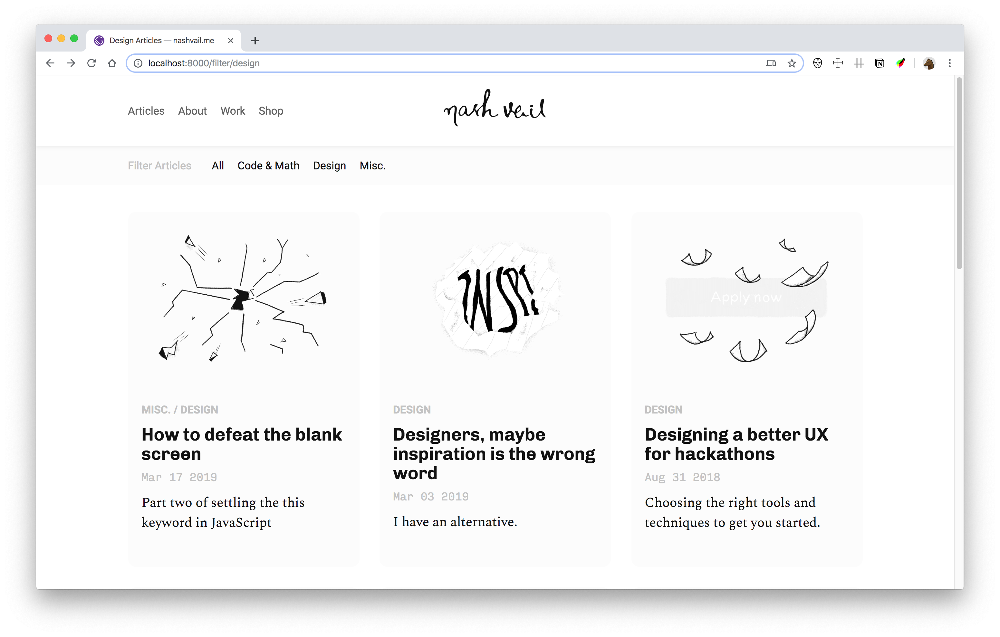

# nashvail.me

## To do before first launch

- [x]  Related articles architecture
    - [x]  Canvas
    - [x]  Trig
    - [x]  Drag
    - [x]  JS this 1
    - [x]  JS this 2
- [x]  A working email subscription
    - [x]  Link to subscription form
    - [x]  Update subscription form with proper text
- [ ]  Complete pockets of solitude (working on pos-fixes branch)
    - [x]  Responsiveness
    - [ ]  Edit text and add melted brain illo
    - [x]  Try to make the images gatsby-image component
- [x]  SideCard complete and responsive with git link
    - [x]  responsiveness
    - [x]  Git Link
    - [x]  Illustration for Git Link
- [x]  Spoilers and Illustrations for Design and Math
- [x]  Spoilers and Illustrations for Design
    - [x]  How to defeat the blank screen
    - [x]  Designers, maybe inspiration is the wrong word
    - [x]  Designing a better UX for hackathons
    - [x]  Designing the perfect wallpaper app
- [ ]  Spoilers and Illustrations for Misc.
- [ ]  Fix the missing image in Understanding Impermanence
- [ ]  Proof read the articles.

## ToDos
- [ ] Add the About page
- [ ] Add Work page