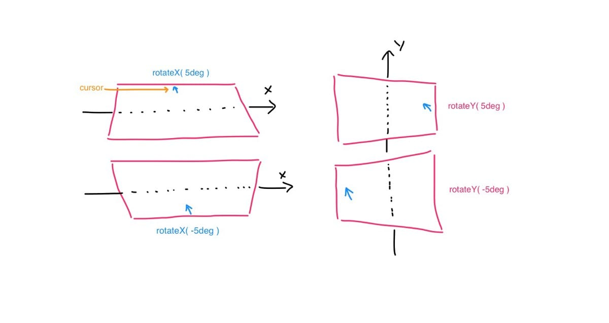

Apple did it again, the attention to detail is amazing. The one thing I loved the most about the [September 9 event](http://www.theverge.com/2015/9/9/9297615/apple-iphone-6s-ipad-pro-apple-tv-event-recap) were these icons.


They are playful, and amazing and you want to just wiggle them again and again. I took a stab at recreating the effect using CSS and JS. What I initially thought would be a complex process, turned out to be pretty simple plus it taught me a couple of things about CSS’s transform property. In the process I ended up creating a small .js file that makes it super easy to create such 3d effects.

Here's the [source code](https://github.com/nashvail/ATVIcons) on github.

## Caution! (A little math ahead)


The effect as I understood is simple, the closer you move the cursor to an edge of an icon, the more it rotates along the perpendicular axis and translates away from the cursor appearing as if it is following the cursor in a 3 dimensional space.


We will need two parameters, the maximum degrees the icon is allowed rotate along any of the axes and the maximum pixels the icon is allowed to translate.

```js
var maxRotation = 5; // in degrees

var maxTranslation = 5; // in pixels
```

That implies, when the cursor is at either of the *extreme edges* the icon would have rotated of 5 degrees from 0, and translated 5 pixels in the opposite direction.



Therefore, we’ll have to make the amount the icon rotates and translates a function of position of the cursor inside the icon.

Let us first concentrate only on rotation along the Y axis, notice Y rotation of the icon depends on the width of the icon and horizontal/x position of the cursor inside the icon.

Think about a factor `k`, whose value falls in the range -1 to 1 and is dependent on the position of cursor inside the icon.

For rotation along y axis, when the cursor is at the left most end(0), `k` has a value of -1, when cursor is at the center(w/2), `k` has a value of 0 and when cursor is at the extreme right(w), k has a value of 1. Now, when k is multiplied by `maxRotation` it gives the exact amount the icon should rotate based on the position of the cursor.


For left most edge, `-1 * maxRotation = -5 degrees`, for the center, `0 * maxRotation = 0 degrees` and for somewhere in between say, k has a value of 0.1 therefore, `0.1 * maxRotation = 0.5 degrees` … and so on for all the different positions of cursor inside the icon.

Mathematical representation of k looks something like this :


Final equation is simply the equation of the red line (of form `y = bx + c` )on the plot, calculated using a simple coordinate geometry formula. All you have to do now is plug in the value of `mouseX` and out comes the value of `k`, which can be multiplied by `maxRotation` which will give us the value of rotation for any position of mouse inside the icon.

Rotation along X axis depends upon the height(h) of the icon and vertical/y position of the cursor inside the icon. The mathematical representation for `k` for X axis rotation is exactly similar to that of Y except that for mouseY = 0, rotation is positive and for mouseY = height of the icon, rotation is negative **(refer Fig. 2 )**, therefore multiplying the above equation by -1 yields the equation for rotation along the X axis.


Let us define a similar factor `l` for translation. Which when calculated the exact same way, comes out to be


`l` can be multiplied with maxTranslation to obtain the amount of translation for any position of mouse inside the icon.

## Thinking 3 dimensionally


I created the feel of depth by manipulating the `maxTranslation` values. Every icon has a base, that is the colored or gradient colored rectangle over or below which other components are placed on or under respectively.

Components above the base have a smaller `maxTranslation` values and the components below the base hold a larger `maxTranslation` value.

For this I defined something called `stacking-factor`, the base has `stacking-factor` of 1, components above base can have stacking factor ranging from 0 to 1, and components below the base have stacking-factor values greater than 1.

`stacking-factor` multiplied by `maxTranslation` is all it takes to create the 3 dimensional effect.

Everything described above takes up less than 50 lines of JavaScript code and is neatly packaged in [ATicon.js](https://github.com/nashvail/ATVIcons/blob/master/js/ATicon.js).

Let us go through a very rudimentary example of using the “library”, it will also give you a more clear idea of the `stacking-factor`.

## Usage


In your HTML file create a simple div with a class name of your choice, let’s call it icon. Inside this div include all the different components of the icon each with an attribute of `data-stacking-factor`. The icon is initialized in JavaScript by calling `ATicon.getInstance()` and passing in it a jQuery wrapped DOM element, `div.icon` in this case.

The above code creates something like this. `upperRect` is black and `lowerRect` is yellow.

<center>
  <figure>
    
    <figcaption class="gatsby-resp-image-figcaption">Stacking Factors : yellow = 1.4, black = 0.4, red =1</figcaption>
  </figure>
</center>


Let us play around with the stacking-factors a bit, in the gif below, yellow rectangle has a stacking-factor of 0.4 and the black rectangle has a stacking-factor 1.4, and base has a stacking-factor of 1.

<center>
  <figure>
    
    <figcaption class="gatsby-resp-image-figcaption">Stacking Factors : yellow = 0.4, black = 1.4, red = 1</figcaption>
  </figure>
</center>


All the rectangles with a stacking-factor of 1

<center>
  <figure>
    
    <figcaption class="gatsby-resp-image-figcaption">Stacking Factors : yellow =1, black = 1, red = 1</figcaption>
  </figure>
</center>

I hope I didn’t confuse the hell out of you.

Thanks for reading, any contributions/questions/comments/suggestions are welcome. You can find me on twitter [@NashVail](http://twitter.com/NashVail) or at [nashvail.me](http://nashvail.me) . Have a good one!