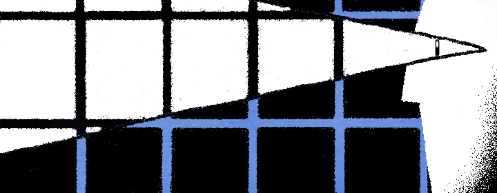
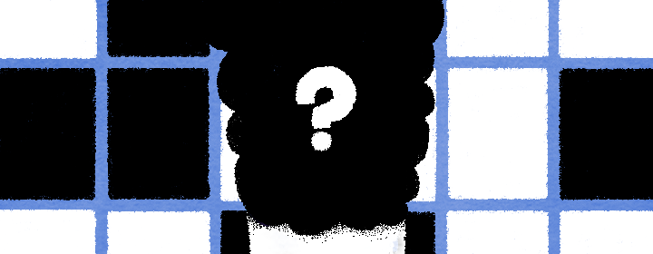
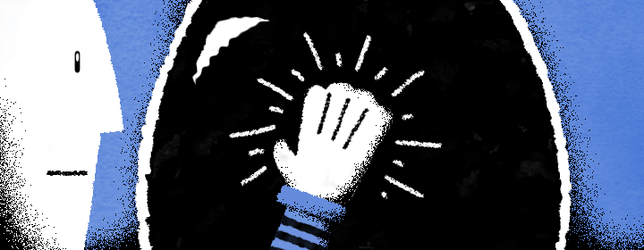

---
keywords:
- failure
- passion
- discovery
- give up
- win
- how to
description: Whay failing repeatedly is important.
title: "How to defeat the blank screen"
date: 2019-03-17
featuredImage: ./images/cover.png
path: "/blog/battleplan"
categories:
- code
---

> **"The [blank] canvas has an idotic stare and mesmerizes some painters so much that they turn into idiots themselves..."**
 

That’s Vincent Van Gogh. One hundred years later, what was then the blank canvas is now the blank screen. The fight though is still the same. Writer or graphic artist, making a pitch deck or writing the first line of code the first thing that stares right into your soul, laughing, standing between this and what is to be is the blank screen. 

> **“...you don’t know how parlalyzing that is, that stare of the blank canvas, that says to the painter “You can’t do a thing!”**

Take it lightly and it’ll bury your ambitions. Because if you’re not aware let me tell you that...

> **"it was easier for Hitler to start World War II than it was for him to face a blank square of canvas."** - (Steven Pressfield, The War of Art)

When the blank screen laughs at you yelling **“You can’t do a thing!”**. You can get off your chair, make yourself a coffee and catch another episode on Netflix. Or, you can listen to Vincent.

> **"Just slap anything on when you see a blank canvas staring you in the face like an imbecile."**

We’ll do that. But if the blank canvas is here for the kill we need a better strategy. All projects are hard at the beginning. Finding a path in the endless expanse of possibilities is hard. It’s like pushing your head into a glass bottle containing the creative ether where ideas just flow. 

Look at this strategy or, battle plan if I should, like oil to the mouth of that bottle. Let’s start.

## Curate
 

Taste is important. Developing a good taste is the first step towards making things that you yourself will like to begin with. If you have a bad taste your creation will be bad. But if you’re in the field you are by *your* choice, congratulations! You already have good taste.

A designer who wants to be good or is good knows a good design from bad. Same for the writer, and the programmer who can tell a tight subroutine from a lousy one.

Now, you need to develop that taste further.

Everyone I have ever met or read about, whose work inspires me has a collection of “Good” stored on their phones, tablets, computers or their basements. Because the best thing you can do is soak your brain with good work and let that permeate and then flow onto the screen. That is the cycle of creativity.

Here’s what I do. I have a Dropbox folder with the name “Good” where I store pictures of any piece of design or mural I find good. Online, I use [Dropmark](https://dropmark.com) to save things I like. My iPad is filled with screenshots of artwork and illustrations taken from all over the internet.

I use [Cacher](https://www.cacher.io/) to store clever pieces of code and then refer back to them when I am coding.

If I ever meet you, the only way I am going to know you’re serious about your craft is if I ask you to pull out your collection and then we can have an hour-long conversation about it. But if you hesitate because there are just selfies on your phone, I’ll probably never see you again.

Curating what you think is good is the first step. Next, question.

## Question
 

A piece exists in your collection because you think it’s good. For no reason. We often look at something (or someone) hey, come back. We often look at something and it strikes a chord. At that moment it’s hard to know exactly why you liked it, and that's okay.

Once you have a collection make some free time. Pick out a random piece from your collection. Put it up in front of you and then study it. Stare at it for 7 minutes, ask why you like it. What parts of it you don’t like. Let it speak to you let it soak into you. Watch the pattern, the negative space, see what other’s won’t see. See what the designer saw, see what the artist saw, see what the coder saw. And then beyond.

Note your thoughts down. Then repeat.

## Slap
 

One of my favorite books is [The Shape of Design](https://shapeofdesignbook.com/) by Frank Chimero. I remember this book because it added “Precarious” to my vocabulary.

> “If it is a design for an exhibition of Ming Dynasty vases, brand it as an interactive show for kids, and put the vases on **precariously** balanced pedestals made of a shiny metal that asks to be touched. (Yes!)”

That’s Frank asking you to start from the worse. There’s a reason why I call this step Slap and not Caress. Don’t overthink, don't plan don't outline or drink water and think, when you have an assignment, come up with the worst idea possible. And then follow through.

See what's in front of you and question. Question why you don't like it. And then iterate.

Questioning is something you have already practiced in the previous step, so it won’t be hard. Be your own worse critic. If you’re a human, you already are.

The idea here is to build momentum. Creating even something that’s far in the south from an ideal outcome builds momentum. Once you execute the worst idea possible there’s no conceivable way that in the next iteration you’re going to do any worse. Do, question, do. Progress at the beginning is going in any direction.

You disappoint yourself because you aim for perfection in the first shot.

Don’t let the blank screen mesmerize you. Be ready for the battle, every day.

> **"Many painters are afraid in front of the blank canvas, but the blank canvas is afraid of the real, passionate painter who dares and who has broken the spell of `you can't' once and for all.”**

Once you’re done, send it out to the world. Then face the insecurity and the voices that whisper you’re not good enough and how badly your work sucks. That’s another battle. We’ll learn to fight it some other day. Remember, you chose this life. Now [follow me on Twitter](https://twitter.com/nashvail).