---
keywords:
- trigonometry
- math
- explanation
- nash
title: "How you can use simple trigonometry to create better loaders"
description: >-
  Since the past few days I have been trying to write my own little JavaScript
  animation library. I know I know no one really cares about a…
date: 2018-05-06
path: "/blog/better-loader"
---

Recently while researching on landing pages, I ran into a website. It’s great and super useful for the people who use it. Something on the site though caught my eye and made me a little uneasy.
<br/>
<br/>
<center>
  <figure>
    
    <figcaption class="gatsby-resp-image-figcaption">Noooooo!</figcaption>
  </figure>
</center>

Noticing this, the jittery unnatural motion and the not so smooth movement of the constituent circles, gave me the idea to write this article.

What we are going to do in this article is recreate a much smoother version of the loader you see above, using the basic concepts of trigonometry. I know it sounds weird, but believe me, it’s going to be fun. You’ll be surprised at how less code needs to be written for all of it to work. And no, you don’t need to know Trigonometry or be a Math genius to understand this article, I’ll explain every. thing.

Here’s what we’ll be making!

<center>
  <figure>
    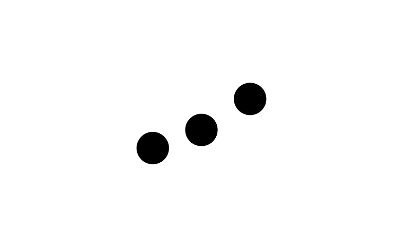
    <figcaption class="gatsby-resp-image-figcaption">Smooootth!</figcaption>
  </figure>
</center>

## Let’s Begin
<br/>
The loader that we are going to make consists basically of three small circles moving in a periodic up and down motion, each, a little out of sync with the others.

Let’s break it down into parts, first, we’ll get a single small circle moving in a smooth periodic up and down motion. We’ll figure the rest of the parts later.

You are always welcome to code along.

### 1\. Positioning the circle
<br/>

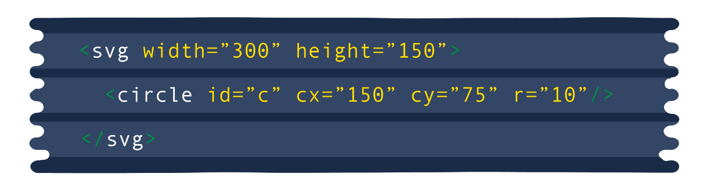

All the above code does is draws a small circle at the centre of the `<svg>` element.

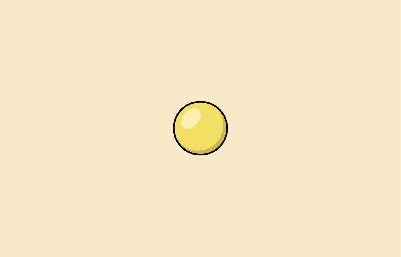

Let’s understand how it does that.

The `width` and `height` property are exactly what you’d imagine them to be. The width and height of the `SVG` element, or the box, for simplicity.

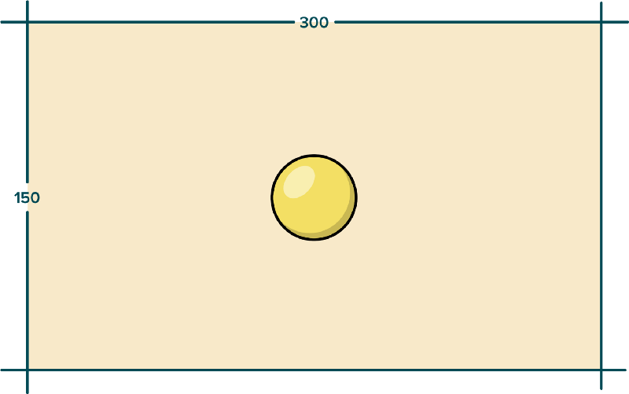

As a default, the `SVG` box has the traditional coordinate system with the origin at the top left and `x, y` values increasing towards right and bottom respectively. Also, every single unit corresponds to a pixel, such that the four corners of the box have appropriate coordinates in accordance with the `width` and `height` it’s given.

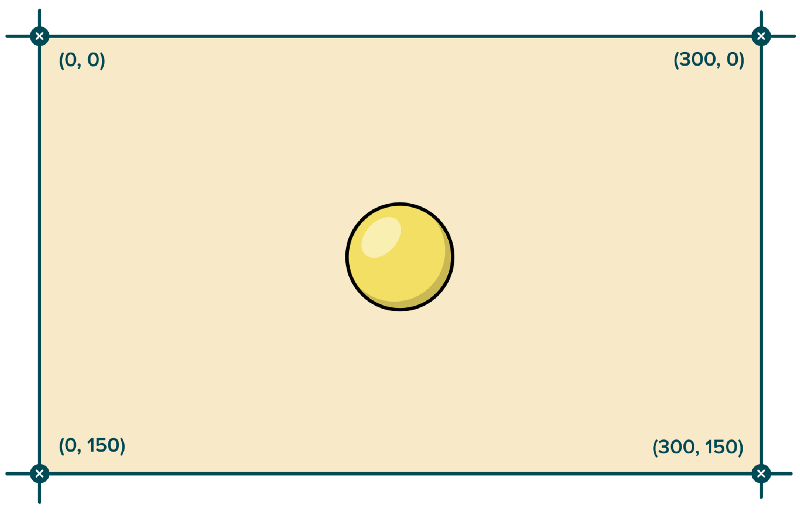

The next step is very straightforward with elementary school mathematics in play. The centre of the box can be calculated to be `(width/2, height/2)` which is `(150, 75)` . We assign this value to `cx` and `cy` to position the circle at the centre.

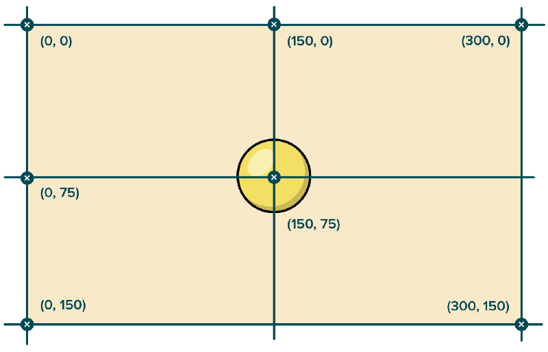

### 2. Making the circle move
<br/>

Our goal in this section is to make the circle move. But not just move in any form of motion. We need the circle to move in a _periodic up and down motion_.

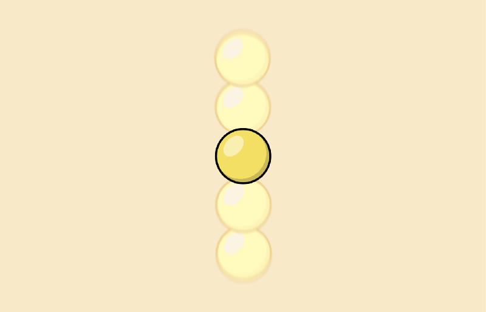

### 2.1 The Math of periodicity
<br/>

Periodic is anything that occurs on a regular interval. The simplest example of periodicity is the rising and setting of the Sun every day. And time. Whatever time it is right now, say 6:30 PM , 24 hours later, it’ll again be 6:30 PM, and 24 hours from then will again be 6:30 PM. That’s regular, that’s something happening precisely at 24 hours intervals.

If it’s noon and the Sun is at its highest point in the sky, 24 hours later it’ll again be there. Or if it’s evening and the Sun is just touching the horizon, ready to set, 24 hours later, it’ll again be doing the same. Do you see where I am going with this?

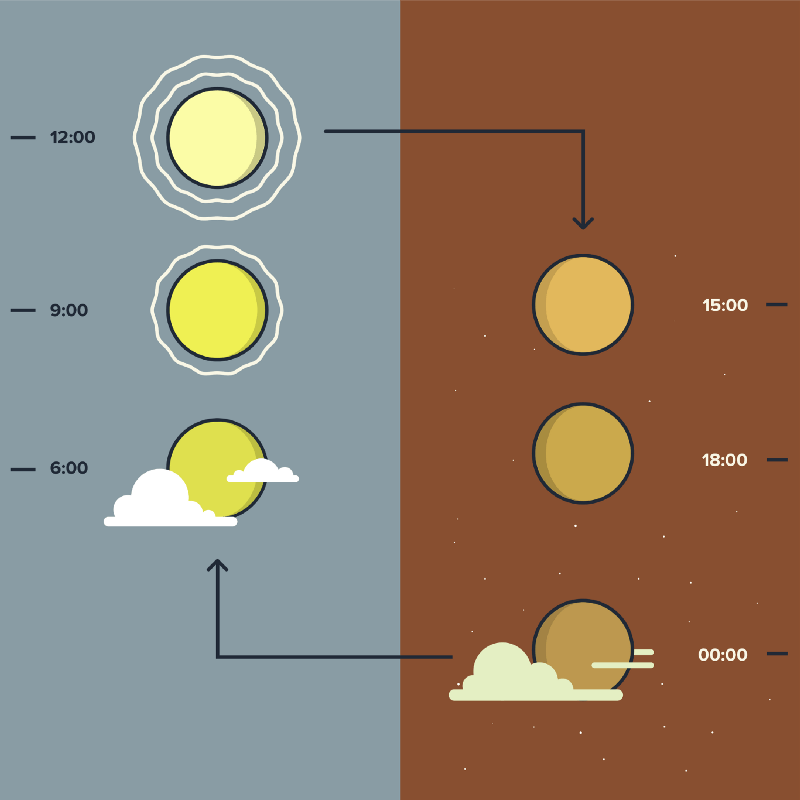

This is a very simple representation, some will say even inaccurate (scientifically) at some levels but I guess it still gets the point of the Sun repeating its position across, quite well.

If we plotted the Sun’s vertical position in the sky against the time of the day, we could see the periodicity even more clearly.

To plot any 2-dimensional curve we need two values, `x` and `y`. In our case `time` \[of the day\] and `positionOfTheSun`. We collect a set of these values, put them on a graph and this is what we get.


Fig. 7: The rising and setting cycle of the sun plotted on a graph.

The vertical axis or the `y axis` is the Sun’s vertical position in sky and the horizontal axis or the `x axis` represents time. As the time entity progresses the “position of the Sun” entity changes its value and repeats the same set of values after 24 hours.

What we are capable of doing, now that we have knowledge of the graph, is figure out the Sun’s position in the sky even if we happen to be inside a cave. To see just how we will be able to do that, first off, let’s go ahead and give a name to our graph, `sunsVerticalPositionAt` .

Once we have that we can form an equation…

```
verticalPositionInTheSky = sunsVerticalPositionAt( [time] )
```

We just need to feed in time to our graph (or mathematically speaking, to our function) and we can figure the position of the sun. Here’s how.

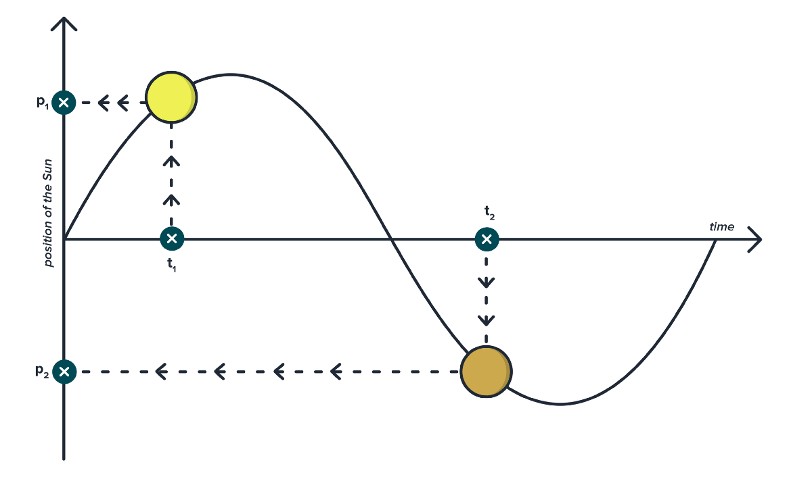

We pick a time at which we would like to know the Sun’s position (say t1), draw a straight vertical line, wherever it intersects the curve, we draw a straight horizontal line from the intersection to the `y` axis. That new intersection gives us the position of the Sun in the sky at that particular time. See we didn’t need to leave our cave!

I guess we have squeezed the analogy enough, let’s go ahead and jump right into some Math. On removing the Sun and all the other decorations from the graph, this is what we get.

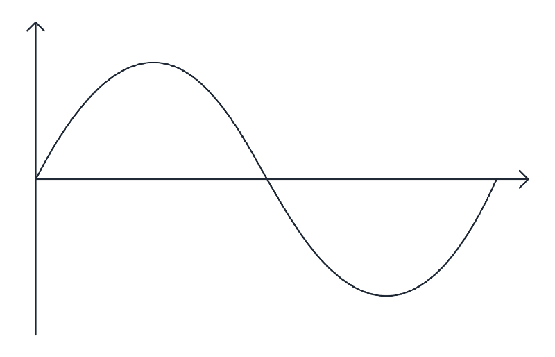

This graph represents periodicity, boldly. An entity (the vertical position of the Sun in our example) repeating its value as another entity (time in our example) progresses.

There are more than just a couple of periodic functions in Mathematics, but we’ll stick with the most basic and the hallmark of periodic functions and the one we’re going to use to create impeccable loaders, `y = sin(x)` also known as the Sine function.

Here’s the graph for `y = sin(x)`.

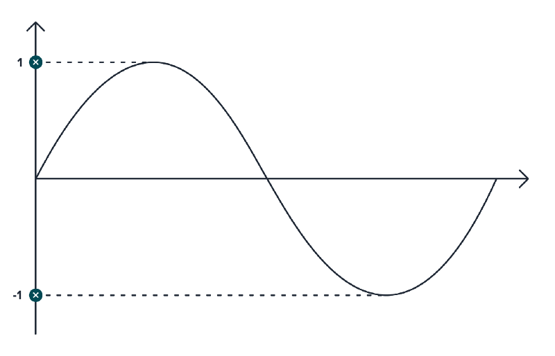

Did something ring a bell? Do you see the resemblance between the equation here and the equation we had for figuring out the Sun’s position in the sky?

We can pass in an `x` and get the value of `y`. Just like we were able to pass in `time` and figure the Sun’s position in the sky …without leaving our cave, okay I am killing the cave joke now.

If you’re thinking what’s [sin](https://en.wikipedia.org/wiki/Sine)? Well, that’s just a name given to a function, like we gave the name of `sunsVerticalPositionAt` to our graph/function.

What’s to focus here is on `y` and `x` . Look how the value of `y` is changing as `x` progresses. (Can you relate this to our example of the Sun changing its vertical position in the sky as time progressed?)

Also notice that the maximum value `y` reaches is 1 and the minimum value it could attain is -1. That’s just a feature, if you will, of the Sine function. The range of values, `y = sin(x)` produces is from -1 to +1.

But this range can be changed by a simple operation. Which we’re going to do in a little bit. But before that, let’s take all that we’ve learned so far and get the circle moving however much we can.

### 2.2 Math to code
<br/>

So far we have the circle inside `<svg>...</svg>` and the circle has an id of `c` . Let’s go ahead and target this circle in JavaScript and make it dance, baby!

```js
let c = document.getElementbyId('c');

animate();
function animate() {
  requestAnimationFrame(animate);
}
```

What’s happening in the code above is simple, first of all we are targeting the circle and storing it in a variable, `c`.

Next, we are using `requestAnimationFrame` along with a function named `animate`. `animate` recursively calls itself using `requestAnimationFrame` to run whatever animation code is inside of it at 60 FPS (whenever possible). Read more about `requestAnimationFrame` [here](https://developer.mozilla.org/en-US/docs/Web/API/window/requestAnimationFrame).

All you need to know is that code inside `animate` at every call, describes a single frame in an entire animation. When it gets called next, recursively, a slight change in the frame is made. This is done over and over at a very fast speed (60 FPS) and that is what appears as an animation.

It’ll make more sense as we go through the code.

```js{3,4,8,10}
let c = document.getElementById('c');

let currentAnimationTime = 0;
const centreY = 75;

animate();
function animate() {
  c.setAttribute('cy', centreY + (Math.sin(currentAnimationTime)));

  currentAnimationTime += 0.15;
  requestAnimationFrame(animate);
}
```

We have added 4 new lines of code. If you run this you’ll see the circle slowly moving at its centre like so.

<center>
  <figure>
    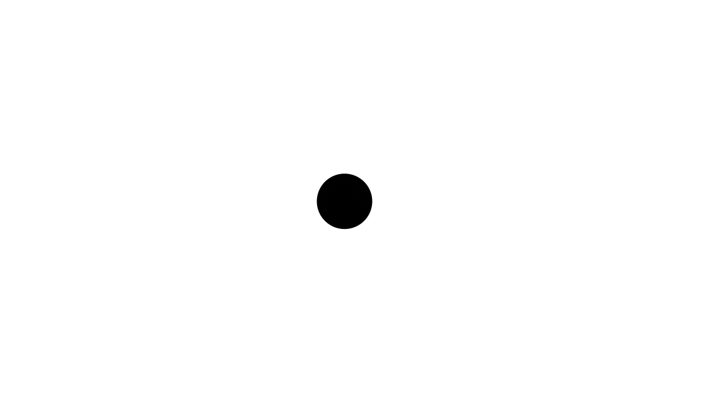
  </figure>
</center>

Here’s what’s happening.

Once we had the coordinates of the circle’s centre, `cx` and `cy` , we were 50% there. All we need to do, is first of all, leave `cx` alone because we don’t want to change circle’s horizontal position. We need to add and subtract equal numbers periodically from `cy` to make the circle go up and down. And that’s exactly what we’re doing in the code.

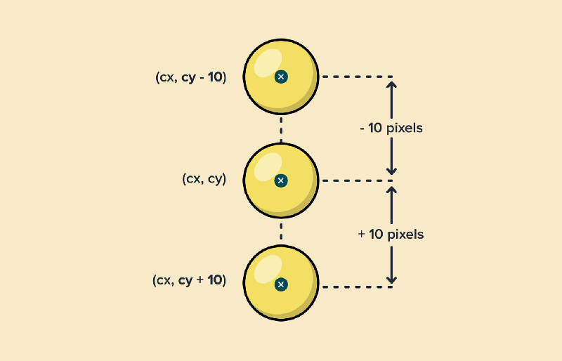
Fig. 11: Changing y coordinate of the circle’s centre.

`centreY` stores in itself the value of circle’s center (75) so that numbers can be added to it or subtracted from it — like already mentioned — to change the circle’s vertical position.

`currentAnimationTime` is a number initialized to 0, that dictates the speed of the animation, the more we increment it at every call, the faster the animation will happen. I have chosen the value of `0.15`, by trial and error because it looks like a good enough speed.

`currentAnimationTime` is the `x` in the Sine graph/function. As the value of `currentAnimationTime` increases, we pass it to `Math.sin` (an inbuilt JavaScript function for Sine), add the number that it generates to `centreY`…


…and then assign that number, using [setAttribute](https://developer.mozilla.org/en/docs/Web/API/Element/setAttribute) to `cy`.


Like we already know, Sine can produce, for any value of `x` a number between `1` and `-1`. So, the values that get assigned to `cy` range from the minimum of `centreY — 1` to the maximum value of `centreY + 1`. And this causes the circle to vertically shake by a 1-pixel margin at its position.

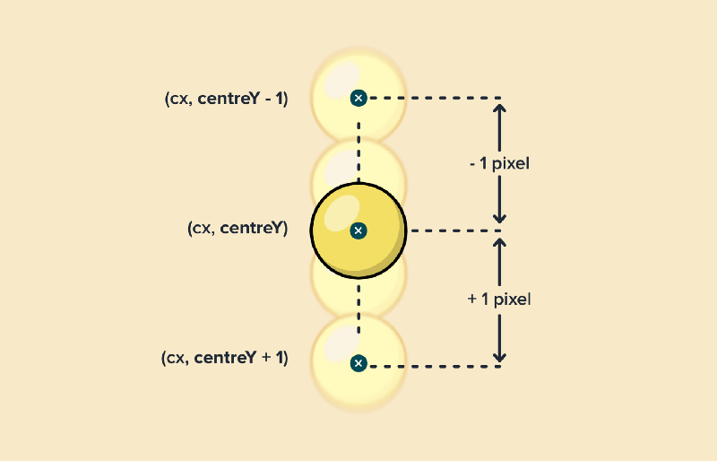

We want to increase that margin. Which means we need a bigger number than 1. How do we do that? Do we need a new function? No!

Remember we were about to do an operation right before the beginning of section 2.2? It’s very straightforward, all we need to do is multiply Sine by the number we want for the margin.

The operation of multiplying a function by a constant is called scaling. Notice how the graph changes its shape, also notice the effect of multiplication on maximum and minimum values of Sine.

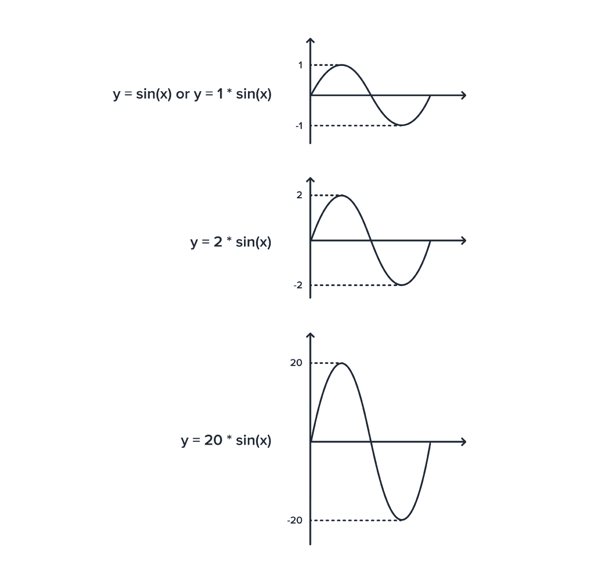
Fig. 13: Graph scaling

Now that we know this, let’s make necessary changes to our code.

```js{9}
let c = document.getElementById('c');

let currentAnimationTime = 0;
const centreY = 75;

animate();
function animate() {
  c.setAttribute('cy',
  centreY + (20 * (Math.sin(currentAnimationTime))));

  currentAnimationTime += 0.15;
  requestAnimationFrame(animate);
}

```

<center>
  <figure>
    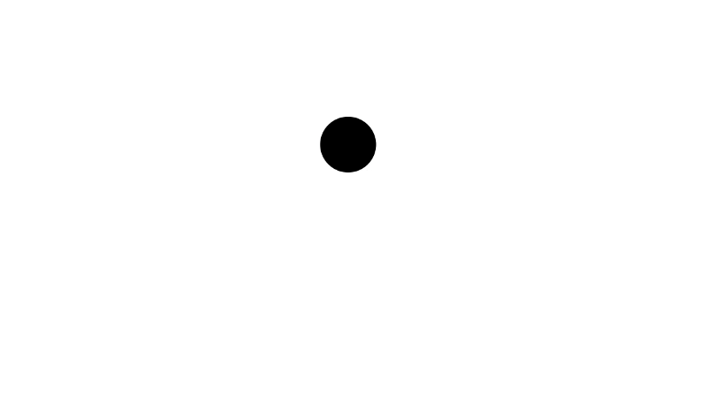
  </figure>
</center>

This produces a very smooth up and down animation of the circle. Lovely isn’t it?

What we just did is increased the **_amplitude_** of the Sine function by multiplying a number to it.

The next thing that we’re going to do is add two new circles to either side of the original circle and make them move in the same fashion.

```html{2-4}
<svg width="300" height="150">
  <circle id="cLeft" cx="120" cy="75" r="10" />
  <circle id="cCentre" cx="150" cy="75" r="10" />
  <circle id="cRight" cx="180" cy="75" r="10" />
</svg>
```

We have made a few changes here and also organized the code. First, notice the two new lines in bold. These are the two new circles, one positioned 30 pixels to the left (150 -30 = 120) and the other 30 pixels to the right (150 + 30 = 180).

Earlier, we had given the only circle an id of `c`, it worked because that was the only circle there. But now since we have a total of 3 circles it’ll be good to give them descriptive IDs. And that’s what we have done, the circles — from left to right — have IDs of `cLeft`, `cCentre` and `cRight`. Our original circle with the id of `c` is now `cCentre`.

Run the above code, and the following is what you get.

<center>
  <figure>
    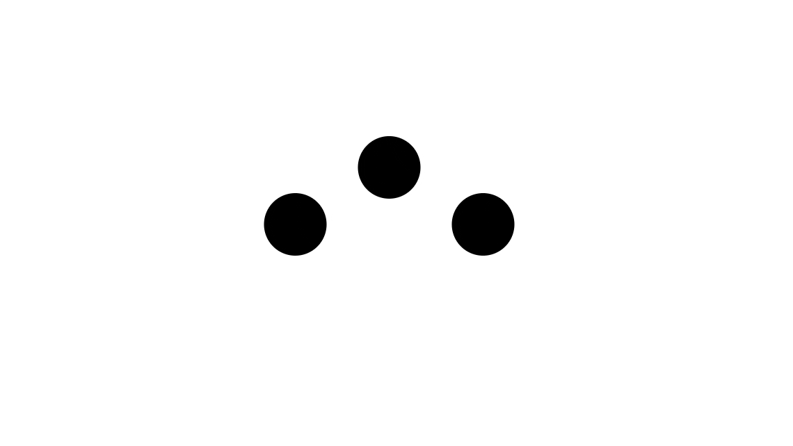
  </figure>
</center>

Good, but the new circles aren’t moving at all! Well, let’s get them moving.

```js{1-3,7,13,16,19}
let cLeft= document.getElementById('cLeft'),
  cCenter = document.getElementById('cCenter'),
  cRight = document.getElementById('cRight');

let currentAnimationTime = 0;
const centreY = 75;
const amplitude = 20;

animate();
function animate() {

  cLeft.setAttribute('cy',
    centreY + (amplitude * (Math.sin(currentAnimationTime))));

  cCenter.setAttribute('cy',
    centreY + (amplitude * (Math.sin(currentAnimationTime))));

  cRight.setAttribute('cy',
    centreY + (amplitude * (Math.sin(currentAnimationTime))));

  currentAnimationTime += 0.15;
  requestAnimationFrame(animate);
}
```

With a few extra lines of code that target the new circles and apply the same animation code to them as `cCentre`, this is what we get.

<center>
  <figure>
    
  </figure>
</center>

Whoa! the new circles are moving! but, what we have right now, in no way possible looks like the loader we set out to build.

Though the circles are moving periodically, the problem is that all the three circles are moving in sync. That’s not what we want. We want each consecutive circle to have some delay in motion. So it looks like the circle other than the one at the beginning is following the motion of the circle before it. Something like this.

<center>
  <figure>
    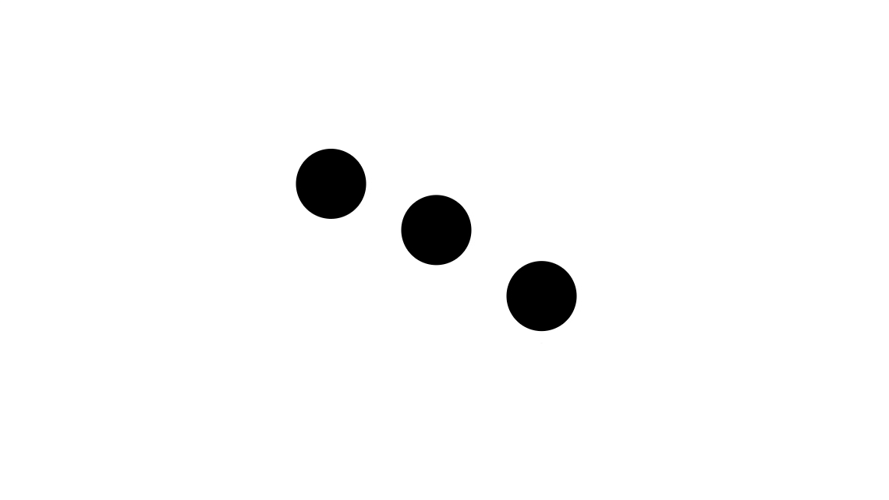
  </figure>
</center>

Do you notice that each circle after the first is slightly out of sync from the one to its left. If you hide other two circles using the palm of your hand you’ll notice that the visible circle is still performing the same up and down motion we coded in section 2.2.

Now to get the circles out of sync, spoiler, we just need to make a minuscule change to our code. But understanding how that minuscule change works is important. Let’s get to that.

If we graph the motion of each circle as in the previous figure, this is what the graphs would look like.

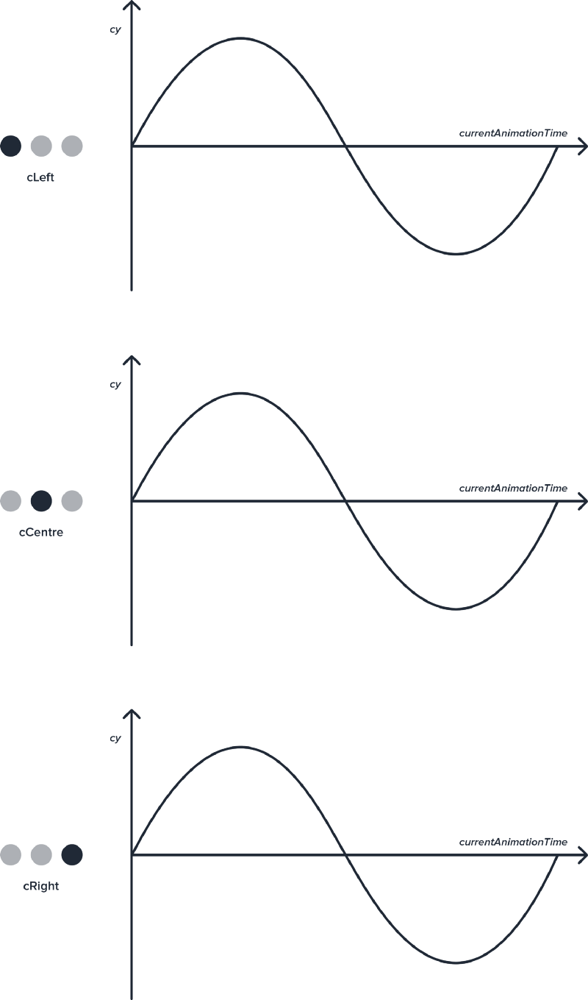

No surprises here, since we know that each circle is moving in the same fashion. Understand that since we’re using the Sine function to make this animation happen, all the curves above are simply graphs of the Sine function. Now to get these graphs out of sync, we need to understand the mathematical concept of shifting/translating graphs.

A shift is a rigid translation in that it does not change the shape or size of the graph of the function. All that a shift will do is change the location of the graph. A shift can be horizontal or vertical. For our intents and purposes we’re interested in horizontal shifts (as you’ll see).

Notice how changing the value of `a` in the Gif below makes the `y=sin(x)` graph move horizontally.

<center>
  <figure>
    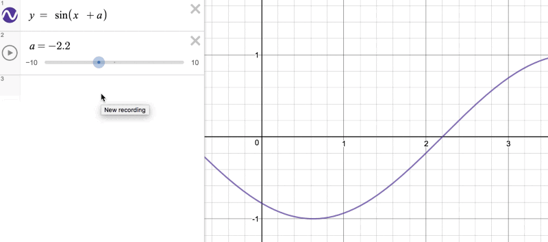
    <figcaption class="gatsby-resp-image-figcaption">Fig. 15: Graph translation (Desmos)</figcaption>
  </figure>
</center>

To understand how this works, let’s get back to the analogy of rising and setting of the Sun.

What was our function again? `sunsVerticalPositionAt(t)`. That’s right! Alright, so we can pass any time to this function and get the Sun’s vertical position in the sky at that particular time. Therefore, say to get the Sun’s position in the sky at 9 AM, we can write `sunsVerticalPositionAt(9)`.

Now consider the function `sunsVerticalPositionAt(t — 3)`. Pay close attention here, whatever time (t) we pass into this new function (which takes in t-3 instead of just t) we’ll get the value of the Sun’s position 3 hours earlier than `t`.

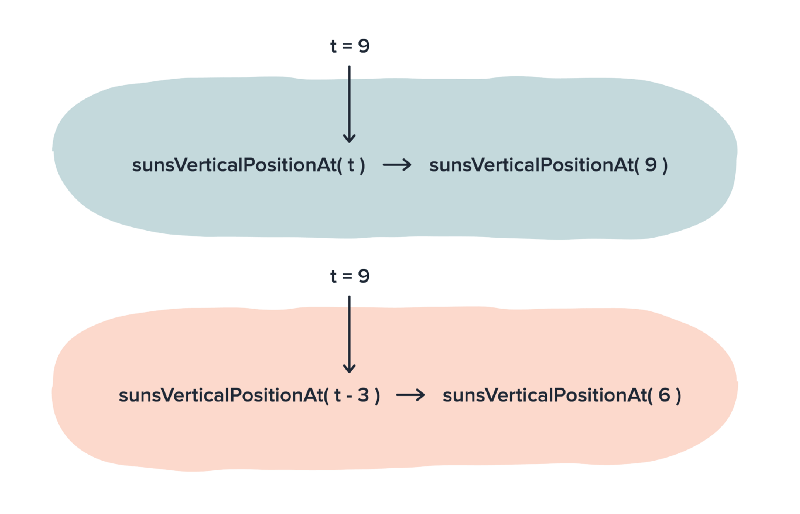

Which means at t = 9 I’ll get the value at 6 at t = 12 I’ll get at 9 and so on. We have wired the function that way, or in other words made function return earlier values than what `t` is passed.

We can also say, we have shifted the graph of the function towards right on the x axis. Notice in the figure below that the old graph at `t = 6` gives us the value `B` . Once the graph is shifted, the same value `B` is returned by the shifted graph at `t = 9`.

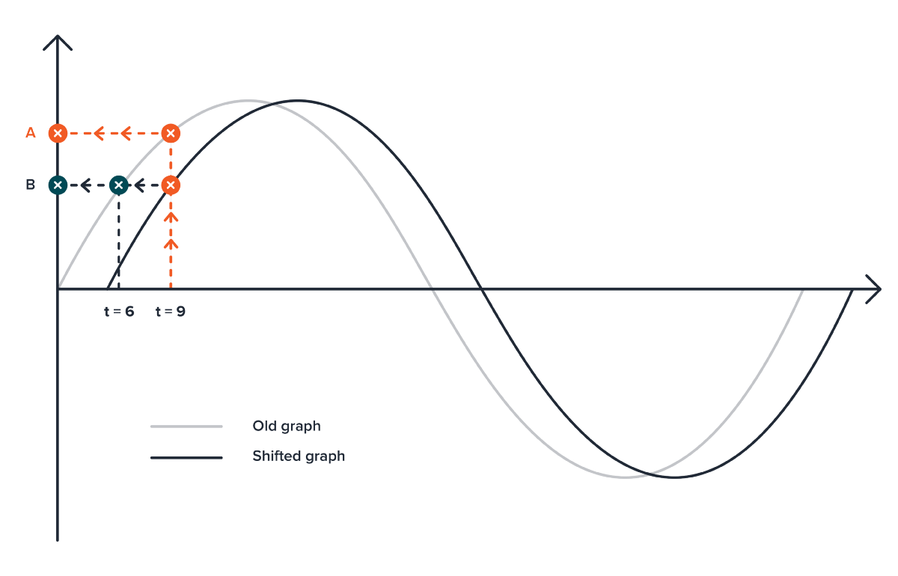

Similarly if we _add_ 3 instead of subtracting, `sunsVerticalPosition(t + 3)` the graph will shift to the left, or in other words it will give values for 3 hours later in the day. Can you figure how?

With the knowledge of this concept in our heads what we can do now is shift the graphs that dictate the animation of the last two circles like so.

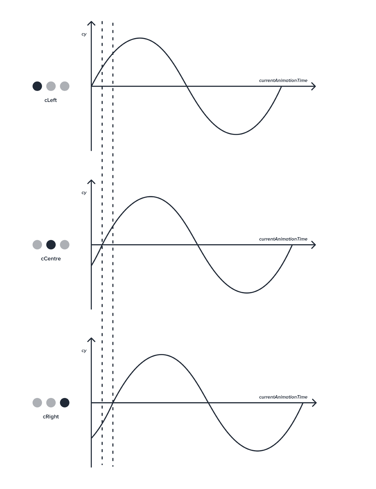

To do this we’ll have to make a very small in change our code.

```js{13,16,19}
let cLeft= document.getElementById('cLeft'),
  cCenter = document.getElementById('cCenter'),
  cRight = document.getElementById('cRight');

let currentAnimationTime = 0;
const centreY = 75;
const amplitude = 20;

animate();
function animate() {

cLeft.setAttribute('cy',
  centreY +  (amplitude *(Math.sin(currentAnimationTime))));

cCenter.setAttribute('cy',
  centreY + (amplitude * (Math.sin(currentAnimationTime - 1))));

cRight.setAttribute('cy',
  centreY + (amplitude * (Math.sin(currentAnimationTime - 2))));

currentAnimationTime += 0.15;
  requestAnimationFrame(animate);
}
```

And that is it! We shifted the graphs that make the `cCenter` and `cRight` animate.

<center>
  <figure>
    
  </figure>
</center>

There it is! our loader circles moving with absolute mathematical precision. High 5! You can always play around with different values, like increment to `currentAnimationFrame` to the control the speed or `amplitude` to control the offset and make the loader animate just the way you want it to.

Nash, you’re crazy for writing such a long article explaining intricacies of a simple loader. No! you’re crazy for reading it this far. [Let’s be friends!](http://twitter.com/NashVail)