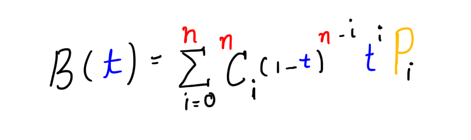
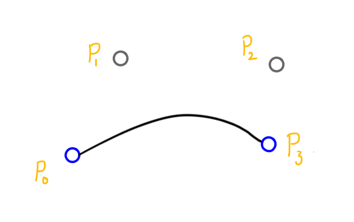

---
keywords:
- bezier 
- curves
- math
- permutations
- combinations
- explanation
- nash
- bezier curves
title: "Nerding out with Bezier Curves"
description: "The math and science of arguably the most beautiful curves on the internet."
date: 2016-05-24
path: "/blog/bezier"
featuredImage: ./images/cover.jpg
---

Since the past few days I have been trying to write my own little JavaScript animation library. I know I know no one really cares about a new animation library but hey, the point is, in the process I stumbled on to Bezier curves. I spent a couple of hours researching, trying to understand them during which I came across this fresh article — “[Mathematical Intuition Behind Bezier Curves](https://buildingvts.com/mathematical-intuition-behind-bezier-curves-2ea4e9645681#.qwbh5kssy)”, which also happens to be the inspiration for this article. It’s mathy and seemingly aimed at brainy people, therefore I had kind of a tough time wrapping my head around the concept. But, fortunately, in the end I did and this led to learning a number of cool new stuff about Bezier curves which I am very excited to share with you.

## What you will be learning
 

I’ll start out with an introduction to curves, what they are, why they’re cool, their mathematical representation. Don’t worry about the Math though, to be honest, I kinda sorta suck at Math, so I have to come with ways of trying to explain it to myself and I am sure “the ways” will work for you too :).

Next, we’ll move on to Bezier curves. What they are, and what makes them different. Their mathematical formula.

Towards the end we will build our own little Bezier curve drawing engine in JavaScript and SVG. How cool is that?

### Curves
 

I don’t need to give a formal definition of curve here right? All of these lines are curves, look at them

Curves are pretty sweet, they can represent a number of things. Like for example the curve below shows the number of [my Twitter](http://twitter.com/NashVail) followers over time.

Alright okay, that looks like a randomly scribbled line. Let me add some context.

It should now give a better idea of what it represents. On the horizontal axis is the number of days since I joined Twitter and on the vertical axis is the number of followers I gained.

On my first day on Twitter, I had 0 followers then it slowly increased, I lost some, gained some, then on the latter half as you can see I gained a number of new followers. That is not the only information we can decipher out of this curve. I can also find out the exact number of followers I had on any given day. It is just a matter of drawing two lines.

Let’s say I’d like to know the number of followers I had on the 60th day.

I draw a vertical line from `60` on the horizontal axis, then from the point where this line intersects the curve I draw a horizontal line. This horizontal line intersects the vertical axis (axis with number of followers) at a point. The value of that point on the vertical axis gives me the exact number of followers I had on the 60th day, which is 126.

Now, where the two red lines intersect, is what is called a **point**. On a 2-dimensional plot, like our Twitter followers graph, a point is uniquely identified by two values, its horizontal coordinate (`x`) and its vertical coordinate (`y`). Therefore writing `(x, y)` is all it is needed to represent a point. In our case, the red point, where the two red lines intersect can be written as `(60, 126)`.

> (60 = x/Horizontal coordinate, 126 = y/Vertical Coordinate)

Alright enough for what a point is, you knew that already. Let’s talk about the curve, which _actually_ is a **collection of many such points** isn’t it?

You take an array of data, like on 0th day 0 followers, 1st day 50 followers … 10th day 76 followers ...100th day 500 followers… and so on. You convert this data to points (0, 0) (1, 50) … (10, 76)…(100, 500)... You plot the points on the graph join them together and there, you have a curve.

So, for a curve you need points and for points you need corresponding x and y values. Therefore, now pay close attention here, a curve can be uniquely represented by something that can spit out x and or y values for us. That “something” is what we call in Mathematics a **function**.

There are many standard functions in Mathematics. Consider the **sine** function.

In functions like this, the choice of x is ours. We give it an `x`, it gives us a `y`. And together we form a point (x, y). We give it another `x` it gives us another `y`, so and so forth we end up with a collection of points, we plot them and get a unique shape.

A function can also be represented in **parametric form**. In parametric form we don’t need to supply a part of the point’s coordinate like we did (`x`) in the previous example. Instead we supply a parameter/variable, generally written as `t` and for every `t` we get both `x` and `y` coordinates, in short, we supply a `t` we get a point.

You will want to know what parametric form is when we talk about the Mathematics behind Bezier curves.

### Bezier Curves
 

Bezier curves are very special curves. The math and the idea behind them blew me away and you should get ready to be blown away too.

Since you’re reading this I assume you are a designer or a developer and have dealt with Bezier curves before, especially Cubic Bezier curves, we’ll get to what Cubic Bezier curves are in a second. Now these curves are used in a variety of places, to create vector graphics, animation paths, [animation easing curves](http://cubic-bezier.com/) e.t.c only because they are so *easy to control*. You don’t need to know a whole lot of Math, none at all to bend these curves to your whims. Think if Bezier curves didn’t exist and people had to come up with unique Mathematical functions for curves for let’s say drawing vector graphics like fonts for example, a nightmare of course.

## Math 😱
 

Alright, time for some Math. I’ll start with the general formula for Bezier curves, it's quite daunting at the first sight, but we’ll make our way through.

“Whoa! Whoa! Whoa! Einstein!”. Hey wait, don’t click away. It’s easy, look, I made it so colorful 🙂.

Let us start breaking the formula down. You can skip over the parts you already know.

### B(t)
 

**B** because it’s a **B**ezier curve. As mentioned earlier in the article about parametric form of curves, `t` is a parameter. You plug in `t` and out comes `x` and `y`, a point. We’ll soon see how that works with the equation above. It’ll be good to mention here that for Bezier curves the value of `t` should be between 0 and 1, both included.

### Σ / Sigma
 

This symbol, Σ, in Mathematics is called the summation operator. The way it works is like this, on the right of this symbol is an expression with a variable `i`, and `i` can only hold integer values. On the top and bottom of the symbol we write the limits of `i`. For each value of `i` the expression to the right is evaluated and added to the total until `i` reaches `n`.

Here are some examples.

Just a shorter notation for something longer.

Alright, looks like we’re clear with sigma.

### nCi
 

This _C_ here, is the C from Permutations and **C**ombinations. Let’s have an impromptu Combinations lesson shall we. Now, in the formula this part is what is called a Binomial coefficient. The way to read nCi is like this, n _Choose_ i. Which is to say given n items in how many ways can you choose i items out of it ( n is always greater than or equal to i). Okay, that might not have made a lot of sense, consider this example : I have 3 items a circle, a square and a triangle. Therefore here, n = 3. In how many ways can I choose 2(i = 2) items out of the 3. In the language of Mathematics that would be written as 3C2 ( 3 Choose 2). The answer is 3.

Similarly,

And when i is 0, there is just one way to choose 0 items out of n, 1, to choose none at all.

Instead of drawing sketches and figuring out the answer to a given Combination expression, there is this generalized formula.

### P sub i
 

This is the important bit. In the general formula for Bezier curve there is t, i and n. We haven’t really touched on what n is. n is what is called the degree of the Bezier curve. n is what decides whether a Bezier curve is linear or quadratic or cubic or something else.

You see, if you have used the pen tool before, you click at two distinct locations to create two distinct points and then you control the curve that is formed between the two points using handles. A Bezier curve is always going to have at least two anchor points, and the remaining are control points that are used to control the shape of the curve. Also, what you call handles are just the control points connected by a line to a anchor point, they’re just there to provide a better mental model. So when you adjust the handles, in reality you are simply changing the coordinates of the control points.

Let us get rid of all the accessories and focus on the core.

The curve you see in the image above is a **Cubic Bezier curve**, or in other words the degree of the Bezier curve shown above is 3, or in the general formula for Bezier Curves you plug n = 3.

n = 1 gives you a linear Bezier curve with two anchor points P0 and P1 and no control points, so it essentially ends up being a straight line.

n = 2 gives you a quadratic Bezier Curve with two anchor points P0 and P2 and one control point P1

and similarly n = 3 gives you a Cubic Bezier curve with two anchor points P0 and P3 and two control points P1 and P2. The higher the n, the more complicated shapes can be drawn.

Now we’re going to form from the general equation the equation for Cubic Bezier curve which involves substituting n = 3 in the general formula. The equation we will get will be in the variable _t_ which as mentioned earlier is a parameter whose value varies between 0 and 1. Also, for the equation we will need 4 Pis ( read: Pee eyes ) P0, P1, P2 and P3. The choice of these points is up to us, after all when we draw vector graphics say using the pen tool we choose the position of anchor points and the control points don’t we? After the changes our equation for Cubic Bezier curve looks something like this.

We are using a little brevity here, in reality each point (P) has two coordinates x and y and also on passing t to the general equation we are supposed to get a point which also has x and y coordinates. Therefore we can write the above equation as

You are about to witness something very special about these equations.

To recap, the mentioned equation is the parametric form of the Bezier curve with the parameter _t_ which can hold values varying between 0 and 1. A curve is a collection of points. Each unique _t_ you pass in to B gives a unique point that builds up the whole Bezier curve.

The magical thing about the equation is that when t = 0, B(0) = P0 and when t = 1, B(1) = P3, therefore, the extreme values of t, 0 and 1 give the extreme most points of the curve which are of course the anchor points. This is not true just for cubic Bezier curves, for a curve of degree n B(0) = P0 and B(1) = Pn.

For any other value of _t_ between 0 and 1 (e.g t = 0.2 in figure above) you get a point which builds up the curve.

Since the whole equation is dependent on the position of the Pis (Pee eyes) changing their position changes the shape of the curve. And that is how Bezier curves work.

Now that we know the Math behind Bezier curves let’s put that knowledge to some use.

I have created a simple JavaScript program that renders a cubic Bezier curve, there is no UI to interact with it because I didn’t want the logic to fade away in all of the UI code and also because I am lazy. But that doesn’t mean you can’t interact with it :).

Was that a little too much to take in? We started out with defining what curves are, from there we moved to points and how they are the building blocks of a curve. Then we went on to Bezier curves and understood the Math to find points that make a Bezier curve up. I hope you learnt something and leaving this article smarter than when you started reading it.

The code for the little custom Cubic Bezier engine can be found in this [GitHub repo](https://github.com/nashvail/BezierCurveGenerator).

**Update:** The Generator can now generate a Bezier curve of any degree and not just Cubic Bezier Curves :) .