### A question occurs, "Why do we need an article for this Nash?"

Okay, grab a seat.

No, wait! First, have a look at this.

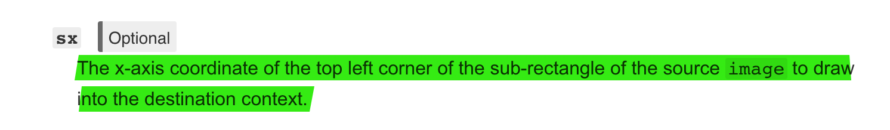

Exactly. What was that?

`drawImage` is the method used to display or "draw" an image on `canvas`. You might, or not already know that it's not as simple as just passing the URI of the image to it. `drawImage` accepts a maximum of 9 parameters. They go something like this, ready? Hold your breath…

```js
image, sx, sy, sWidth, sHeight, dx, dy, dWidth, dHeight
```

Breathe, out.

I found the [documentation](https://developer.mozilla.org/en-US/docs/Web/API/CanvasRenderingContext2D/drawImage) for `drawImage` a little confusing and hardcore. Just the documentation, yes. The concept and how the API works is great for all the needs that it is supposed to serve.

We'll go over the parameters mentioned above one by one, in a way that'll make complete sense to you. If at any point in the article you find yourself going "I just wanted to draw an image on my canvas dear Nash. Why put my mind through a ringer?", it'll be an understandable frustration.

The way `drawImage` works does seem complex to some extent, but this complexity makes `drawImage` immensely powerful, and useful -- as we'll see through examples at the end -- And moreover, the complexity is just on the surface, once you understand the whole picture it's a downhill bicycle ride on a country road somewhere in Europe.

By the end of this article you'll be able to visualise how `drawImage` will draw any given image on `canvas` just by looking at the values of the 9 parameters. Sounds like a superpower you might wanna have? Okay then, let's dive right in!

## Loading an image in canvas

Let's start simple with an image and an HTML5 `canvas`.

Here's what our directory looks like

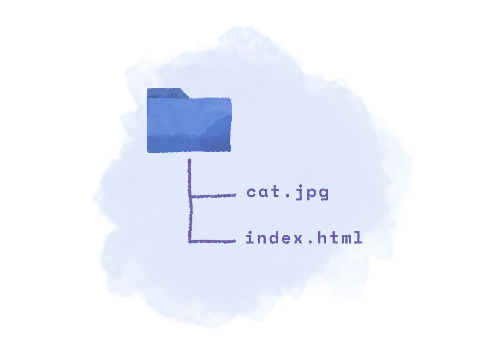

Inside of our `index.html` file we have created a new canvas element like so.

```html
<canvas id="my-canvas" width="400px" height="200px" />
```

Our goal is to take the `cat.jpg` image and put it on the canvas (`#my-canvas`). And like I already said, it ain't that easy betty! Otherwise I won't be writing this article, you feel me? Good.

To start with, let's target the `canvas` element using JavaScript and get its context.

```js
const myCanvas = document.getElementById("my-canvas")
const myContext = myCanvas.getContext("2d")
```

We need `myContext` to interact with the `canvas` element. It's like, if `canvas` is a blank sheet of paper, the canvas's context is the pen. Intuitively, you'll tell your pen to draw something on a blank sheet of paper, and not just yell at the paper to draw something on itself right?

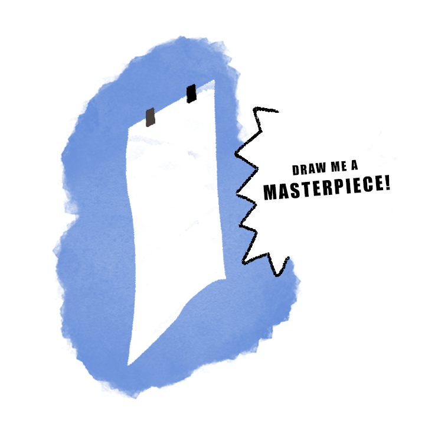

There is a number of things you can do with `context`. You can draw a rectangle, or an ellipse or a line, or, an... **image**. Also, notice that the context `myContext` is implicitly linked to `myCanvas`. You can have multiple `canvas`s and call `getContext()` on each of them to get a new context/pen for each. In our case we are dealing with just one canvas (`myCanvas`) and just one context (`myContext`).

Alright, with that out of the way, we can finally start getting our feet wet with `drawImage`.

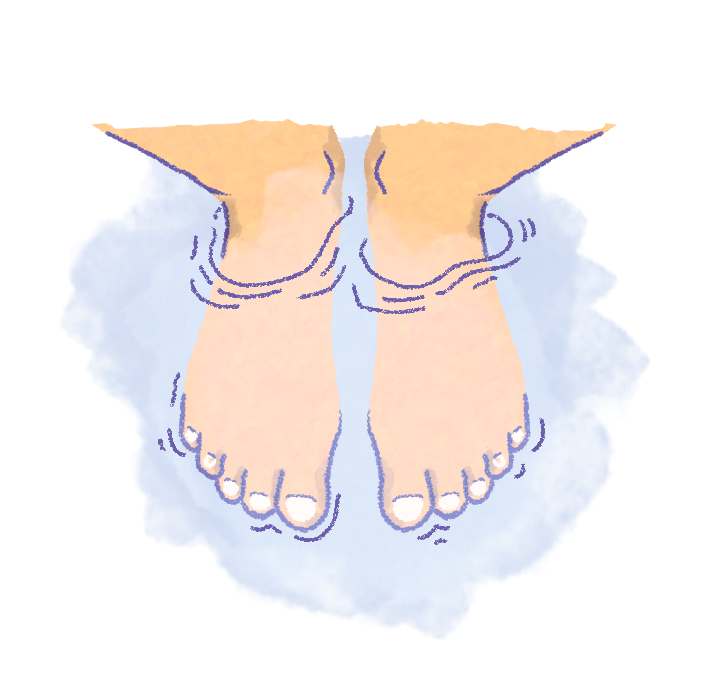

For a refresher, here are the 9 parameters that `drawImage` accepts.

```js
image, sx, sy, sWidth, sHeight, dx, dy, dWidth, dHeight
```

We'll start with the first parameter, `image`. Let's, like the constitution of many countries, write something that doesn't work.

```js
context.drawImage("./cat.jpg", 0, 0)
```

See the two zeroes at the end? Good. This is not the part of the article where you're supposed to understand what they're there for. Ignore them for now, just keep in the back of your head that Nash wrote 2 zeroes and didn't explain them. I won't mind.

Now notice `...('./cat.jpg',..` in the line of code above. Appears to be a perfectly correct URI, doesn't it? And it is, buuuut, if you fire up `index.html` in a browser you'll see a long long error message identical to what's shown below.

```js
ERROR: The provided value is not of type '(CSSImageValue or HTMLImageElement or SVGImageElement or HTMLVideoElement or HTMLCanvasElement or ImageBitmap or OffscreenCanvas)
```

\*gulp\*

The error is telling us that it needs an image _element_ and not just a URI to the image. To get around that, this is what we can do.

```js{3-7}
const canvas = document.getElementById("canvas")
const context = canvas.getContext("2d")
const img = new Image()
img.src = "./cat.jpg"
img.onload = () => {
  context.drawImage(img, 0, 0)
}
```

That is something you didn't expect, did you? Canvas needs a preloaded image in order to draw/display it in itself. No need to show any contempt towards canvas by the way. It has its reason, it's just like the rest of us. We'll eventually see what those reasons are and maybe then you'll be able to sympathise.

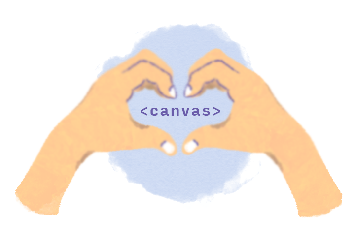

To recap,

`drawImage` asks for 9 parameters, first of which is `image`. We looked and understood that `canvas` requires a preloaded image to draw and not just a URI to the image. Why does it need that? It will become clear as you read.

Now it's time for the remaning 8 parameters. Pop your collars! I am gonna learn you some graphics editing first!

## How to crop a picture

Every single, even the most basic of graphics editing programs come with the feature of cropping. It's fairly simple, open an image > select the area you want visible > hit crop. And just like that the naked beer belly of that obnoxious smelling old man is out. Poof!

<center>
  <figure>
    
    <figcaption class="gatsby-resp-image-figcaption">Image credits: https://cheezburger.com/4406785536/classic-valentines-day-lover</figcaption>
  </figure>
</center>

Technology! Saving teenage girls' Instagrams since Instagram existed.

Let's take a step back, and stop riiight, here.

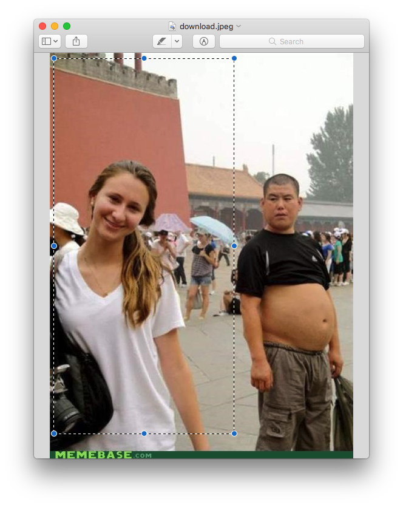

Let's mark some points on it.

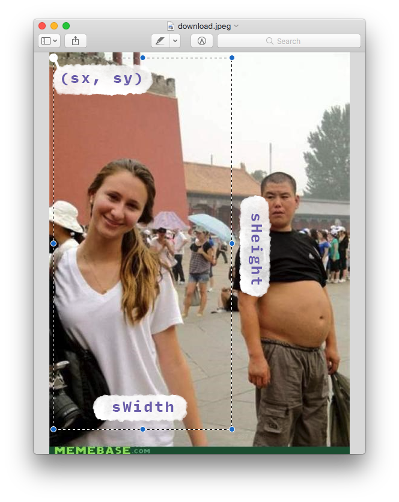

"Wait a second! `sx`, `sy`, `sWidth` and `sHeight`? I have seen them before!"

Yes, about a minute ago! Which leads us to the fleshiest part of the article.

## Displaying an image on canvas, Step 1: Selection

The first task `drawImage` performs--behind the scenes--is it selects a portion of the image based on the four `s` parameters (`sx, sy, sWidth, sHeight`). You can say that s in all the s.. parameters stands for "select".

Here's how it goes. `sx` and `sy` mark the point on the image from where the selection is to begin, or in other words the coordinates of the top left corner of the selection rectangle. `sWidth` and `sHeight` then, are the width and height of the selection rectangle respectively. You can scroll right up to the last image to get a clearer picture of what I am trying to explain.

"But why the selection Nash? Can't it just display the entire image?" We're getting closer to all your answers, patience.

Just know that the first step `drawImage` performs after receiving a proper image is it selects a portion/area of the image based on the s parameters `(sx, sy, sWidth, sHeight)` you provide.

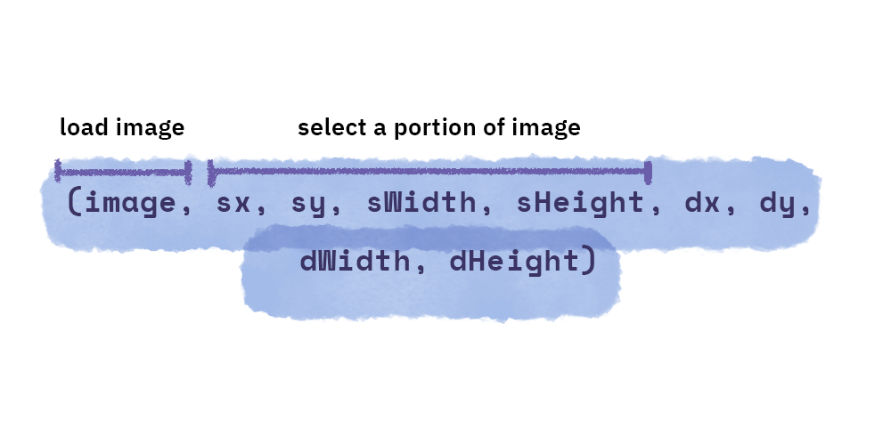

Remember that you don't always have to select a small portion of the image, you can select the entire image if you want to. In that case `sx` and `sy` will have values 0 and 0 respectively and `sWidth`, `sHeight` will be the same as the image's width and height.

Also, negative values are welcome for `sx` and `sy`. The values of `sx` and `sy` are relative to the origin of the image on the top left.

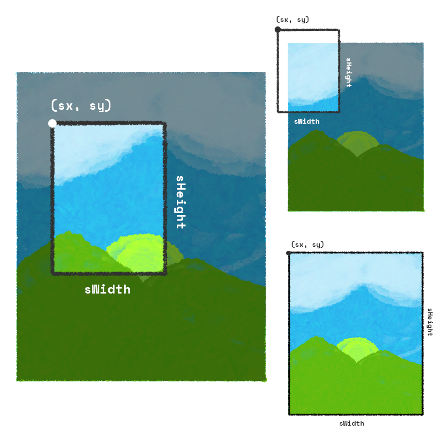

Once `drawImage` has selected the area of image you asked it to -- and we'll see soon why selecting an area of the image helps -- the next step is to draw the selected portion of the image on the canvas.

"Originally" `s` and `d` in the official documentation stand for 'source' and 'destination'. But, just between us, let's call it 'select' and 'draw'. It makes much more sense this way, doesn't it?

Again. `s`election is done, the next step is to `d`raw.

## Displaying an image on canvas, Step 2: Drawing

To draw the selected portion of the image, we again need four parameters.

1. x Coordinate of where to start drawing on the canvas. ( `dx` )
2. y Coordinate of where to start drawing on the canvas. ( `dy` )
3. How wide to draw the image. ( `dWidth` )
4. How high/tall to draw the image. ( `dHeight` )

The values of `dx` and `dy` will be relative to the origin of the canvas.

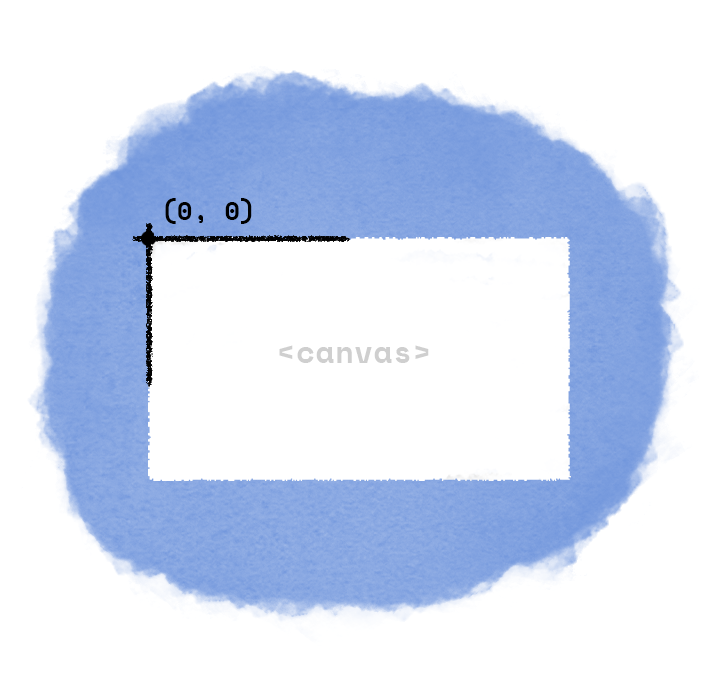

There's a very important but subtle detail to notice here. `dWidth` and `dHeight` are in no way tied to `sWidth` and `sHeight`. They are independent values. Why do you need to know that? Well, because if you don't choose values of the width and height of 'draw' carefully you will end up with a stretched or squashed image, like this.

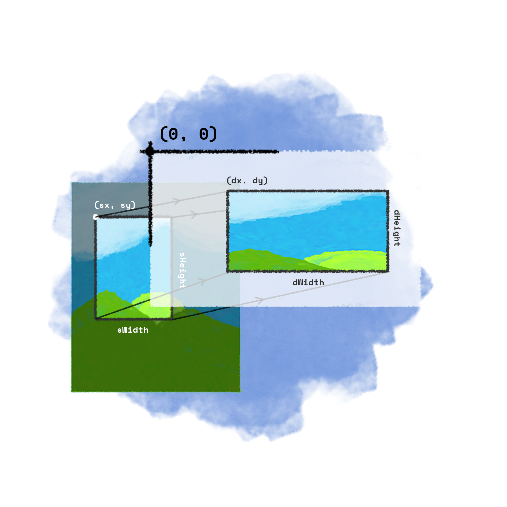

So if that's something you're not looking for, which I hope you're not. Make sure to maintain the aspect ratio. Or so to say `sWidth` divided by `sHeight` should be equal to `dWidth` divided by `dHeight`. That was a small little disclaimer, you're the king of your own world and free to choose whatever values you like.

The whole process of displaying/drawing an image on canvas can thus be summarised in just two steps. Selection and Drawing.

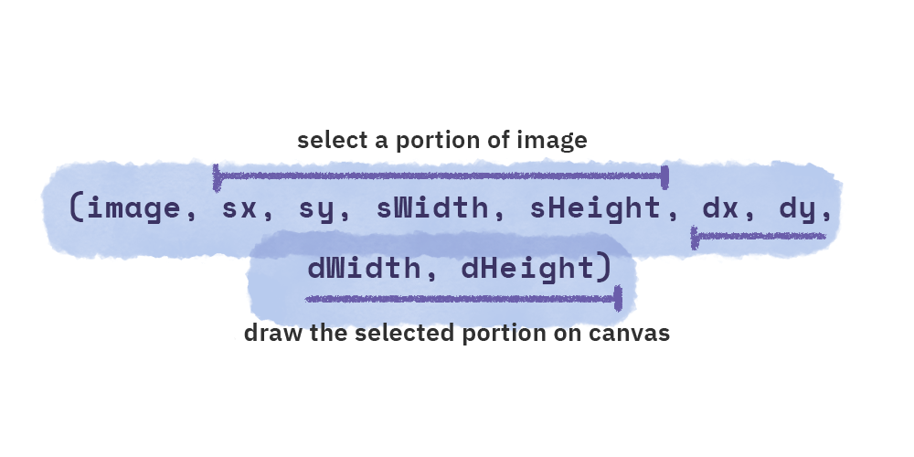

Awesome! Not so complicated after all is it?

Now at this point, we're done with all the theory. In rest of the article that follows we'll bake the batter of knowledge spread around your head with a fun and practical example and you'll be good to go. But, before we do that, let's talk about one last important thing concerning `drawImage`.

## The default values

Remember my lecture on "hey keep the aspect ratio and be careful don't take chocolates from strangers…"? Well, as it turns out, you can omit certain values and not worry about the aspect ratio at all. As far as taking chocolates from strangers go, you're the king of your own world.

Here's one way to use the method.

```js
drawImage(image, dx, dy)
```
That is all! In this case you're telling `drawImage` only the location on canvas where to start the drawing. The rest, `sx`, `sy`, `sWidth`, `sHeight`, `dWidth` and `dHeight` are taken care of automagically. The method selects the entire image `(sx = 0, sy = 0, sWidth = image's width, sHeight = images' height)` and starts drawing on canvas at `(dx, dy)` with `dWidth` and `dHeight` same as `sWidth`(image's width), `sHeight`(image's height) .

Remember the two zeroes that I didn't explain? That is where the two zeroes came from.

Yet another way to use the method is,

```js
drawImage(image, dx, dy, dWidth, dHeight)
```

In this form `sx, sy, sWidth and sHeight` are taken care of, and the method automatically selects the entire image and leaves it upto you to choose where and how large of an image to draw.

Pretty cool! isn't it?

If I can have your attention for another two minutes I'd like to tell you why `s`election and `d`rawing are two separate operations. And how it is helpful.

Do I have your attention? Great! 

So here. 

Heard of sprites before? You see, sprites is a computer graphics concept where a graphic may be moved on-screen and otherwise manipulated as a single entity.

...?

I copied this definition from Google to sound suave.

Alright alright. Remember Mario?

Good.

Let's do something fun.

## Animating Mario with drawImage

You see, when Mario moves forward/backward or in any other direction, it appears as if he is walking. His position changes but also there is an accompanying animation of his legs and hands moving.

How do they do that? Do they show different images of Mario in succession, like a flipbook and it appears as if he's moving?

Well, a 50% yes. Imagine how resource intensive storing and loading a huge set of images describing every frame of animation in our program (or game) would be. Instead, there's a single image and all the positions are laid out in **a grid**. Like the one shown below.

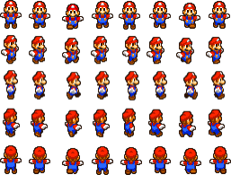

To execute an animation, instead of loading a new image every millisecond a portion of the same image is shown through a viewport just at different positions. Clever isn't it?

So yes, it's sorta like a flipbook, a clever flipbook actually.

Now if you could just stretch a little and pop your knuckles I would like us to recreate Mario's walking animation. We'll use the sprite shown above and everything we have learnt about `drawImage` so far.

Ready? Here we go!

Let's take another look at our sprite and try to figure the grid dimensions that it has been laid out on.

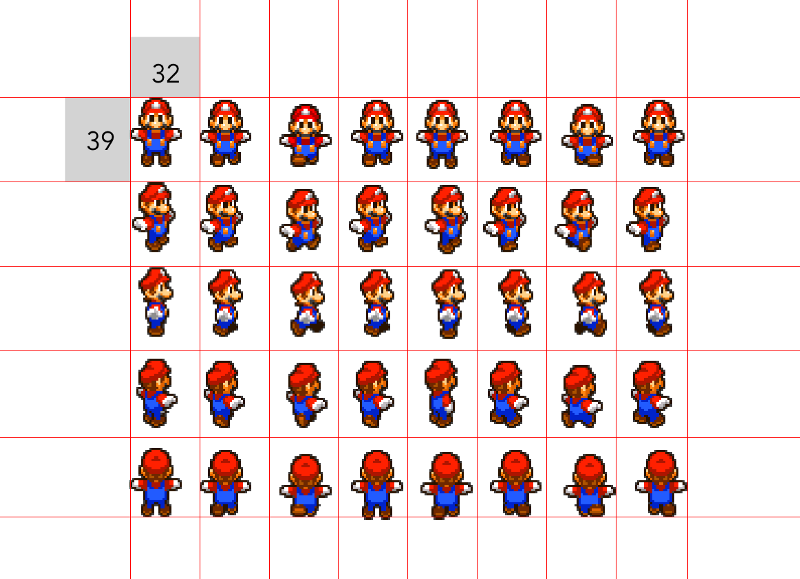

All that we have done here is imagined a grid over the sprite. Notice that the entire grid is made up of cells of equal dimensions `(32 x 39)`. But it's still just one image, remember that.

Great! Now let's get to writing some code. We'll start in the usual way by first creating a `canvas` element, grabbing it and its context in JavaScript and then loading our Mario spritesheet.

```js{5,7}
// index.js
const canvas = document.getElementById('canvas');
const ctx = canvas.getContext('2d');
const img = new Image();
      img.src = './mario.png';
      img.onload = () => {
        ctx.drawImage(img, 0, 0);
      };
```

```css
/* style.css */
canvas {
  /*Add a border around canvas for legibility*/
  border: 1px solid grey;
}
```


Above code will result in the following.

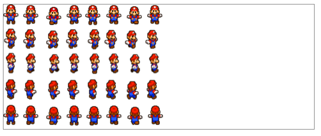

Wokay! we've got the image showing! What's happening really?

Here, we're using the form of `drawImage`--`drawImage(image, sx, sy)`--where the whole image is `s`elected and `d`rawn on the canvas as it is.

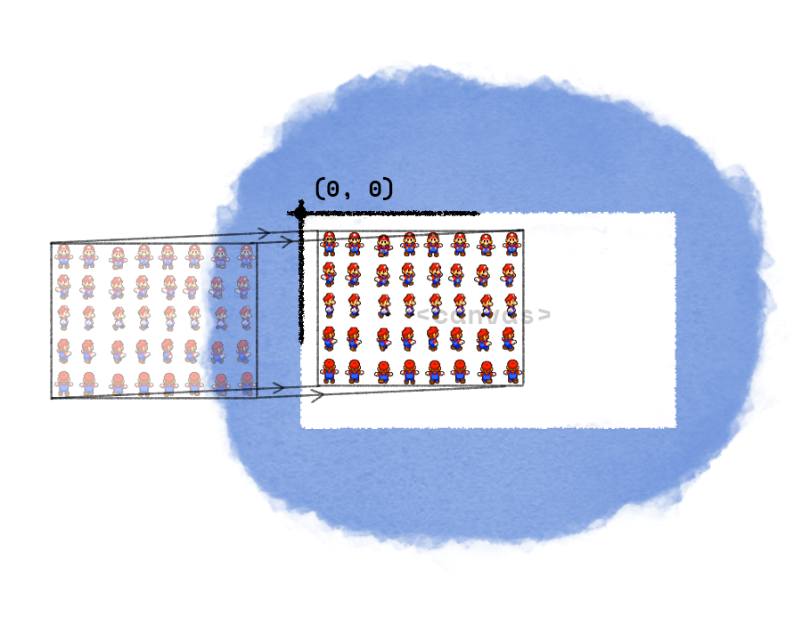

What we want to do, first of all, is select just one cell of the grid and draw just that single cell. Let's start out by first making tweaks to our code that selects the first cell in the third row, the one in which Mario is standing facing east. We'll figure how to animate once we have that done. Sounds good? Lovely!

Let's make the necessary changes to our code.

```js{9-22, 4-5}
const canvas = document.getElementById('canvas');
      const ctx = canvas.getContext('2d');
// Mario variables
const MARIO_WIDTH = 32;
const MARIO_HEIGHT = 39;
const mario = new Image();
mario.src = './mario.png';
mario.onload = () => {
ctx.drawImage(
    // Image
    mario,
    // ---- Selection ----
    0, // sx
    MARIO_HEIGHT * 2, // sy
    MARIO_WIDTH, // sWidth
    MARIO_HEIGHT, // sHeight
    // ---- Drawing ----
    0, // dx
    0, // dy
    MARIO_WIDTH, // dWidth
    MARIO_HEIGHT // dHeight
  );
};
```

First off, notice the two variables `MARIO_WIDTH` and `MARIO_HEIGHT`. They are the dimensions of the grid cell, that's all they are. We defined them to make it easier for us to traverse the grid using just multiples of each of those constants. Makes sense?

Good.

Next, in the `// Selection` block we defined the area of the image we want to select, in the `// Drawing` section we defined the width and height and the position from where to start drawing on the canvas... aaand just like that we managed to draw just one cell of the entire imaginary grid.

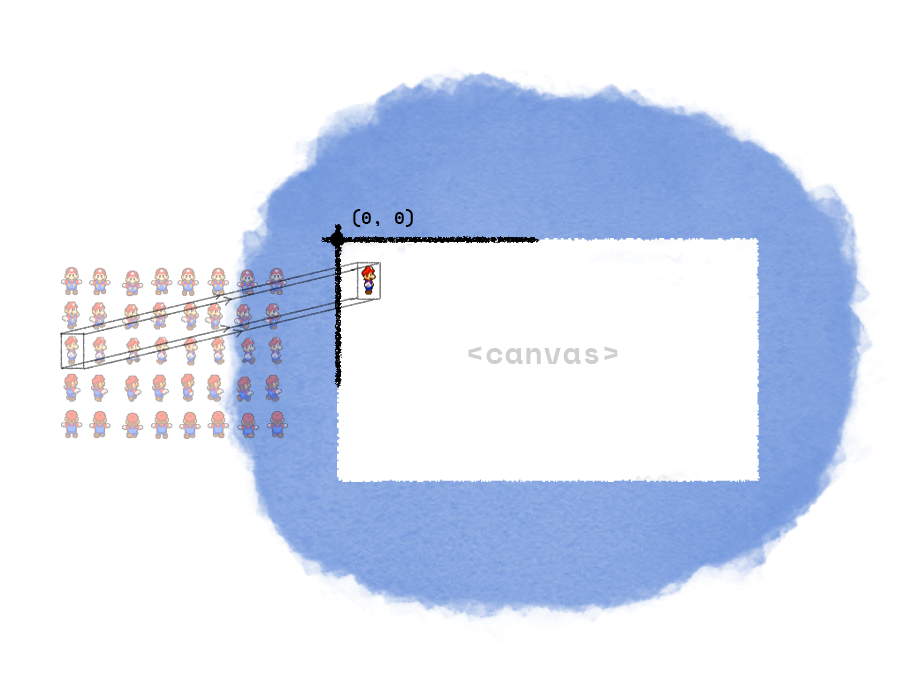

Pretty simple, just selection and drawing. Now at this point I'd like to digress into an older topic about aspect ratio. "Nash! again? ugghh" I know I know. But it's cool! Look!

If I change the values of `dWidth` or `dHeight` or both of them, look at how the image stretches and squashes.

```js{13-14}
...
ctx.drawImage(
    // Image
    mario,
    // ---- Selection ----
    0, // sx
    MARIO_HEIGHT * 2, // sy
    MARIO_WIDTH, // sWidth
    MARIO_HEIGHT, // sHeight
    // ---- Drawing ----
    0, // dx
    0, // dy
    MARIO_WIDTH * 2, // dWidth
    MARIO_HEIGHT * 1.5 // dHeight
  );
...
```

