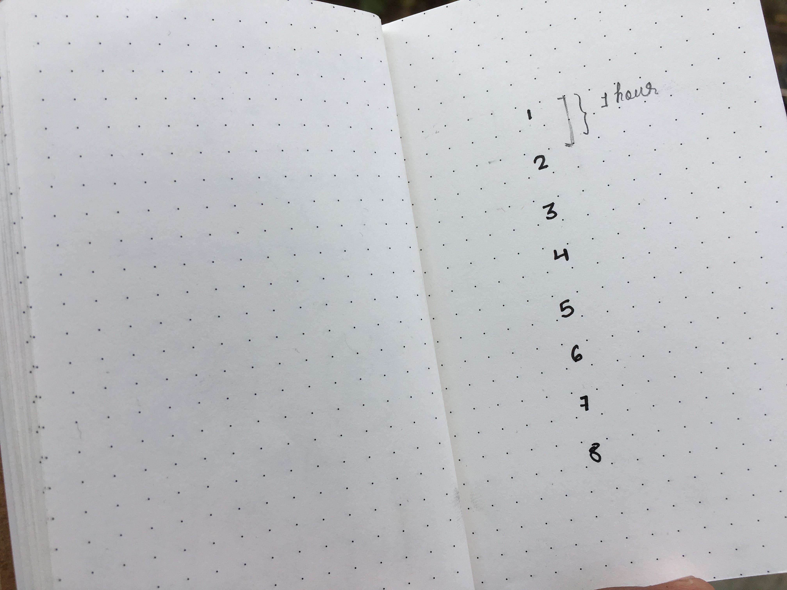
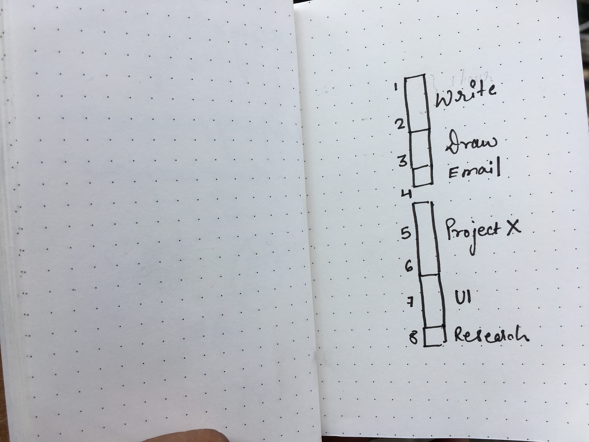
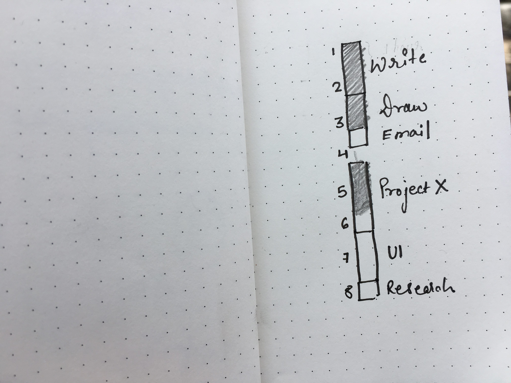

Steven J wasn't wrong when in what is now the most famous commencement speech on the internet reminded us that, "Your work is going to fill a large part of your life.". The words on passion and love which followed are debatable but the fact that your work actually makes up a large portion of your life is absolutely not. It's a fact both of us are aware of but don't care about enough. The question is, how do you make something better? You start by bettering parts of it. If I am cleaning my room I'll start with my bed, then move to the floor, and then to my desk. Bringing order and cleanliness to something that makes up a large chunk of your life therefore, is also improving your life as a whole, isn't it? 

In my list of: moments in 2018 that changed my life, one of the moments--no kidding-- is in which I clicked purchase on Amazon's listing of [Deep Work](https://amzn.to/2CA3jZt). "Reading books can be life changing?" Yes!, Thank you! We're off to a great start. I found Deep Work brimming with insights that'll change the way you perceive many things. In this article, though, I am only going to focus on the parts of the book that talks about the how (tips and techniques) and the why of "deep work". 

All set?

Awesome!

Cal, in Deep Work, references a quote from [4DX](https://amzn.to/2CAt77H) which says "**People play differently when they're keeping score.**". Now I'd like you to hold on to this thought and let it sink into you, slowly, as we continue. 

Allow me to ask you this, by the end of your day are you aware of the hours you have spent working, and on what. How close are you to finishing your current project or, how many hours did you spend working on the project you just wrapped? Have you thought that the reason your drawing skills are still below mediocre is that you have spent less than an hour in the entire last week beating on it? And these aren't just any "hours". I am not talking about the distracted blurry mess of hours wherein you have your constantly beeping phone put on the same table you think you're doing your life's work on. I am talking about undistracted hours. "Deep" hours.

>  Deep Work: Professional activities performed in a state of distraction-free concentration that push your cognitive capabilities to their limit. These efforts create new value, improve your skill, and are hard to replicate. - **Cal Newport**, [Deep Work](https://amzn.to/2CA3jZt)

Can I safely assume that a significant part your waking and hence working hours are spent distracted with mindless scrolling and surfing? That you're either caught up in poking the Twitter bird to chirp something new but totally unimportant or watching your friends share the supercut of their lives while safely hiding the blooper reels behind the cancer of services that Instagram and Facebook have become? I may be wrong in thinking you're like the most. I apologise. But, if I am right, let's talk.

> When you work you are a flute through whose heart the whispering of the hours turns to music. - **Khalil Gibran**, [The Prophet](https://amzn.to/2BK4HH2)

Let's understand why deep work is important. It's intuitive really, somehow you know the answer, why deep, focussed and undistracted work trumps over shallow distracted productions. When you're focused you are only thinking about the task at hand, no phone beeping, or people trying to grab your attention, it's just you and your work and inevitably what's produced in that focussed state is superior to what is produced when you're checking your phone and refreshing social media every 3 minutes. It's all about momentum, each new focussed second adds a bit to it. Second after second the momentum builds up and rolls you right into the zone - a state where you are so engrossed in your craft, you lose the track of time. It's only in the zone where you can produce work that you can look back and be proud of.

> To produce at your peak level you need to work for extended periods with full concentration on a single task free from distraction. Put another way, the type of work that optimizes your performance is deep work. - **Cal Newport**, [Deep Work](https://amzn.to/2CA3jZt)

One other interesting concept Cal talks about is "attention residue". Attention residue is something that remains, weighing your mind down when you repeatedly switch tasks or get distracted. When your phone beeps and vibrates like its having epilepsy, and you being you lift it up, check it and get back to your work. Even in doing so you have harmed your concentration. By seeing a message that you cannot deal with at the moment you have created in your head "attention residue". The attention residue left by such unresolved switches dampens your performance.

> High-Quality Work Produced = (Time Spent) x (Intensity of Focus) - **Cal Newport**, [Deep Work](https://amzn.to/2CA3jZt)

All in all, it doesn't take an old wise man living somewhere in the Himalayas to understand that deep work is necessary to produce at an elite level. We do know this, and a lot of other things and we do have the wisdom. But it's one thing to know what's right and another to do it. We're humans, after all, it's effortless for us to make things and situations worse than better.

> “...hell is a bottomless pit, and that's because no matter how bad it is, some stupid son of a bitch like you could figure out a way to make it a lot worse" - Jordan B. Peterson

I have adapted one of the techniques Cal describes in Deep Work to bring some order to my working habits. It's also what motivated me to write this article. You don't have to follow bit by bit or at all. It's you, you're different. I just want you to know about this, see how and *if* this can fit in your life and be beneficial.

This technique revolves around creating a routine for your day in the morning or whenever you start your working hours. Now wait, I have always despised routines and maybe you do too and maybe this is because routines for us is pushing our eyelids open on the first chime of the alarm only to get up and reach a place where all we do is struggle from letting them get shut again. That's just a bad version of routine, a version that we see in schools and colleges and bad offices. Routines that are created by someone else for us. Routines don't have to be prisons.

> Someone once asked Somerset Maugham if he wrote on a schedule or only when struck by inspiration. "I write only when inspiration strikes," he replied. "Fortunately it strikes every morning at nine o'clock sharp." - **Steven Pressfield**, [The War of Art](https://amzn.to/2CB5mfE)

As a full disclaimer, the technique I use is about 90% based on Cal's method, not *exactly* like his, just a version of it that suits me. So instead of referring to it as "Cal's technique" I'll just write, here's what I do. So, here's what I do. At the beginning of each day on a blank page, I mark the number of hours I plan on working that day. The estimate often overshoots the number of hours I actually work by an hour or two and that's okay, no sweat, again, we're not creating a prison, we're creating a routine. 

The way you number the hours is in blocks, like this.

The hours are numbered on alternate lines so that each hour is made up of two blocks of 30 minutes. 

Once you have the blocks ready you can start assigning tasks to them. For example, I am writing this article because I have assigned "Write" to the 1st, 2nd and the 3rd block. 

It's important that you don't see the blocks as Ball and Chain. If during the day something urgent comes up or I stumble on an insight I readjust the remaining blocks to accommodate that, it's all fluid. Often when there's a little too much to do and priorities are not defined, I list my current ongoing projects on the left page, of them I pick the ones I plan on working on that particular day. Of *those*, I pick the tasks that need my attention and creativity the most. I assign those tasks to the morning blocks because I work best in the mornings.

The beauty of doing this is that even before I open the lid of my laptop I know exactly what I am going to work on. Which means I can get straight to the task instead of firing up Chrome and spending the next 20 minutes burning my mental energy on social media while figuring out what I should start working on. 

>  Don’t ever arrive at the office or in front of your computer without a clear list of priorities. - **Timothy Ferriss**, [The 4 Hour Work Week](https://amzn.to/2RkKHoe)

To keep track of the number of hours and to make sure the hours are deep I use a free app called [Freedom](https://freedom.to/). With Freedom, you can start a work session of 30 minutes, an hour, or an hour and 30 minutes. Whatever you wish. Once a session starts Freedom blocks all the time chewing websites and applications. So even if by habit you slip into Google Chrome's address bar and type twitter.com, freedom asks you to "Do what matters". Look at the mess we have made of ourselves, we need technology to keep us away from technology. It's pathetic, but that's our species for you.

> Do what matters. - Freedom App

As the day rolls on, after each work session I color its respective boxes. At the end of the day, I have an exact count of the hours I have spent working and on what. Then, for example, if I find something that isn't taking off or lying incomplete I know it's because I haven't spent enough time with it.

In following this technique you end up creating a scoreboard for your working hours. Maybe it's a psychological quirk but I have found myself trying to keep the score rolling by working more and with more focus. Even if your daily tasks fall under being "creative", waiting for inspiration to begin work is a fallacy. To quote from David Brook's piece [The Good Order](https://www.nytimes.com/2014/09/26/opinion/david-brooks-routine-creativity-and-president-obamas-un-speech.html) in which he goes over the working habits of the most creative people in history, he notes, "creative people organize their lives according to repetitive, disciplined routines. **They think like artists but work like accountants.**”

Overall, having a tangible proof--even in the form of coloured squares--that you have worked, does a lot good to your brain than you can imagine. At the end of the day, the sloppily shaded squares tell you that your time, the stuff that makes your life up was spent on something that's meaningful to you and not on autopilot hopping from one shallow task to another. Knowing this is critical because you don't get to eat the fruit the same day you plant the seed. 99% of our lives are spent in the "process", the arrival of the desired result lasts only for a fraction. On top of that, the result may not even give you the satisfaction and happiness that you anticipated. It's no wonder if we make our days just a wait for the result to show up we'll never be content. How can we be? the result, the source of contentment is not here yet. But when you know for sure that even though the result is nowhere near the horizon but today, you have inched closer to it, it gives you confidence in yourself, satisfaction and contentment. And more than anything having a structure or a routine for your working habits puts you in the driver's seat. It gives *you* a say in what *you* spend *your* hours on. 

The [findings of Winifred Gallagher](https://amzn.to/2SlppUT), a behavioural psychologist, report that the longer we spend our working hours in the focussed state leveraging the complex machinery of the human brain, the more meaning and satisfaction we associate with our working life. And if we weren't mistaken in accepting, at the beginning of the article that, a large chunk of our lives is actually spent working, finding meaning and satisfaction in "working life" is inevitably also finding meaning and satisfaction in life. And isn't that something we all can use.