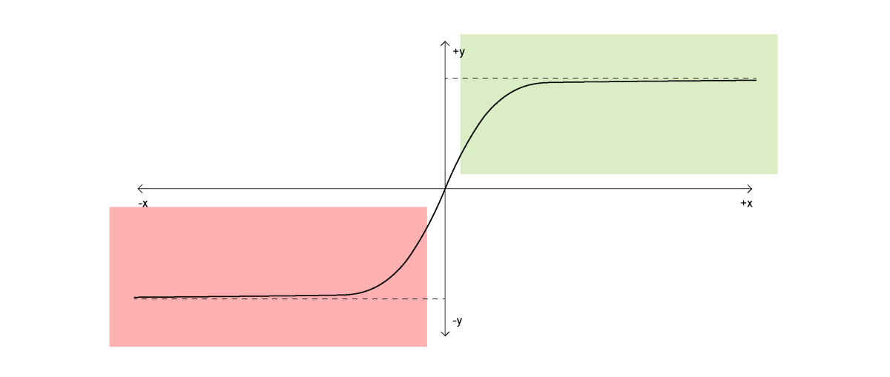

---
keywords:
- math
- animation
- request animation frame
- requestAnimationFrame
- JavaScript
- CSS
- web
- interaction
- UI
- UX
- UI/UX
title: How to fix dragging animation in UI with simple math
path: "/blog/dragging-animation"
date: 2018-07-31
description: "A little bit of Math and requestAnimationFrame magic can give life to the most mundane of interactions."
---
<br/>


Let’s start it this way, consider any piece of software where dragging elements around is a major part of the interaction. Now pay close attention to how the elements behave when being dragged around. I’ll pick [Trello](https://medium.com/u/fb5dd2d116a1) as an example.

Here’s what dragging a card between lists in Trello looks like.

<center>
  <figure>
    
  </figure>
</center>

Notice how the card stays rigid and rotated at a fixed angle when being dragged? It’s subtle, I understand, but it kinda got to me. So I sprinkled some UI animation fairy dust over it and...

<center>
  <figure>
    
  </figure>
</center>

<center>
  <figure>
    
  </figure>
</center>

See the difference? A more natural looking drag.

In this article we’ll be learning how to build a card that behaves naturally when it’s being dragged around. There’s some math and a lot more to learn. Ready? Pop your collars and crack your knuckles, cuz we’re about to…

## Begin
<br/>

The thirty-thousand-foot view, from an airplane of our goal is to make dragging cards around look more natural.

Let’s dig a level deeper. Here’s what we want to do, precisely.

When a card is being dragged in the UI, we want the card to react to the environment. That is, when it’s being dragged in the right hand side direction, we want it to slightly rotate to show the effect of that drag and show a similar effect when being dragged left.


We want the rotation of card to be direction aware. If the card is being dragged towards right it should rotate clockwise and anticlockwise when being dragged left.

Not just that, the rotation should also be speed aware. The more swiftly you drag the card the more the magnitude of rotation. In simpler words, dragging card with more speed makes the card rotate more, and rotate less when being dragged slowly.

And of course there is a limit to that rotation. We don’t want the card to topple over. Once the dragging stops the card then returns back to its initial value of rotation, 0.

Overall, here are the TODOs we discover on digging a level deeper into the “make card dragging look natural” abstraction.

1.  Rotate according to the direction card is being dragged in.
2.  Rotate more or less depending on the speed of the drag.
3.  Limit the amount of rotation. (No toppling)
4.  Damp the rotation to 0 once dragging has stopped.

Since rotation of the card is dependent on how fast the card is being dragged, figuring out the velocity of drag would be a perfect place to start. Let’s see how we can do that.

## Finding the velocity of drag
<br/>


When the card is being dragged, what is basically happening is it’s changing its position on the screen.

Right?

Good.

For our intents and purposes — and also to keep the article digestible — we’re considering just the horizontal (left & right) motion of the card. Taking the vertical (up and down) motion into account adds very little to the effect and creates major code complexity. Therefore we’re choosing to ignore it.

Okay, so velocity. You see, keeping it simple again, velocity is just speed with a sign.

“Yeah? that makes so much sense Nash!”

Save your sarcasm for a minute. Let’s start with speed.

Consider the person below at position 0.


We close our eyes for 60 second and open again. Now the man is at a position of 10 meters.


This means he ran 10 meters in the 1 minute (or 60 seconds) we were closing our eyes. So his speed would be,

```
(final position — initial position)/(final time — initial time)

=> (10–0) meters / (60–0) seconds

= 10 meters / 60 seconds or 1/6 meters/second
```

Good enough speed there man!

But let’s rewind to when the person was at his initial position. We close our eyes again, but this time the man runs to the left.


What is his speed this time around?

Performing the exact same calculation…

```
(final position — initial position)/(final time — initial time)

=> (0-10) meters / (60–0) seconds
=> -10 meters / 60 seconds

= -1/6 meters/second
```

Hah! You see, it’s the same speed but this time we have a negative sign in front of it. The sign tells us the direction he ran in. (+) means towards right and (-) indicates left. That’s it, that’s velocity, speed with a sign where the sign tells us the direction of motion.

Similarly, for our card, if we subtract its current position from its previous position we can not only find the speed of the drag but also the direction it is being dragged in.


There are multiple ways to go around doing that in code. One could be, storing the previous position of card and then subtracting it from the current position. But another, “clever-er” way to deal with this would be to subtract card’s position from Mouse’s position. This will work for us because, since the card is being dragged, the next position of the card will be Mouse’s current position. Makes sense?

Take a minute and let that sink in.


Here’s a pen created from all that we have learnt so far. Notice that the card currently just follows the mouse around without having to be dragged.

“Blasphemy!”

No, simplicity. We’ll add the drag functionality later if needed, for now the card following cursor around gives us just enough ground to test the animation we’ll be building.

In the pen below, at the top left is text that depicts the horizontal velocity or x-velocity at which the card is moving. Also notice how this value and its sign changes depending on how fast and in which direction the card is being dragged.

Played around?

Good.

Let’s now dissect the code since this is the pen we’ll be building the rest of the animation on top of. You can read the `JavaScript` code by going to the `JS` tab in the pen above.

Let’s begin with `MousePosition`.

```js
var MousePosition = {
  x: 0,
  y: 0
};
```

The `MousePosition` Object is simply supposed to store the `x` and `y` coordinates of the cursor.

Similarly, the `CardPosition` Object will hold the `x` and `y` coordinates of the card.

```js
var CardPosition = {
  x: 0,
  y: 0
};
```

Now when I mention subtracting position of Card from position of Mouse to calculate velocity, you know what to do.

Great! Onwards!

Another mundane piece of code you’ll find in the pen is a `'mousemove'` event listener that continuously updates the value of `MousePosition` Object.

```js
document.addEventListener('mousemove', function(e) {
  MousePosition.x = e.clientX;
  MousePosition.y = e.clientY;
});
```

The above block of code is as self explanatory as it can be.

With all of this banality shoved out of our way, let’s concentrate on what’s important and new.

Read the code below, but for now, ignore everything that isn’t bold. Also, if you already know how `requestAnimationFrame` works, you can skip the next two paragraphs.

```js{1,11,14}
var update = function() {
  xVelocity = (MousePosition.x - CardPosition.x);

  CardPosition.x = MousePosition.x;
  CardPosition.y = MousePosition.y;

  // Update the position of card
  card.style.top = CardPosition.y + 'px';
  card.style.left = (CardPosition.x - 125) + 'px';

  requestAnimationFrame(update);
};

update();
```

`update` is a function that gets called recursively over and over, but, with `requestAnimationFrame`. `requestAnimationFrame` is this beautiful feature that makes smooth animations possible without slowing the user interface down.

`requestAnimationFrame` works like a flipbook, every call to the passed in function (`update` in our case) is like a flip in a flipbook. `requestAnimationFrame` invokes the passed in function right before the next browser repaint. This invocation before the next repaint is how `requestAnimationFrame` makes sure that animations run at 60 frames per second at almost all times without bloating the user interface.

Technically, every call to `update` calculates the changes in frame (entity that animations are made up of) and executes them. These changes played on top of each other at a speed of about 60fps creates the illusion of animation.

Let’s look at the calculations we’re doing and steps we’re performing to paint the next frame.

Number one, calculation of xVelocity.

We started this section going over how subtracting position of Card from Mouse gives us the velocity of card, that is what is happening in bold below.

```js{2}
var update = function() {
 xVelocity = (MousePosition.x - CardPosition.x);

  CardPosition.x = MousePosition.x;
  CardPosition.y = MousePosition.y;

  // Update the position of card
  card.style.top = CardPosition.y + 'px';
  card.style.left = (CardPosition.x - 125) + 'px';

  requestAnimationFrame(update);
};

update();
```

Just to regurgitate, here’s all the data we get from velocity of the card.

1.  The speed of drag or how fast the card is being dragged.
2.  The direction of drag, whether the card is being dragged right (positive velocity) or left (negative velocity).

In the subsequent lines of code inside `update` we’re updating `CardPosition` to match `MousePosition`.

```js{4-5}
var update = function() {
  xVelocity = (MousePosition.x - CardPosition.x);

  CardPosition.x = MousePosition.x;
  CardPosition.y = MousePosition.y;

  // Update the position of card
  card.style.top = CardPosition.y + 'px';
  card.style.left = (CardPosition.x - 125) + 'px';

  requestAnimationFrame(update);
};

update();
```

and later updating the `card` DOMElement which we grabbed using…

```js
var card = document.querySelector('#card'); // line 7
```

.. to match the `CardPosition` like so.

```js{7-10}
var update = function() {
  xVelocity = (MousePosition.x - CardPosition.x);

  CardPosition.x = MousePosition.x;
  CardPosition.y = MousePosition.y;

 // Update the position of card
  card.style.top = CardPosition.y + 'px';
  card.style.left = (CardPosition.x - 125) + 'px';
  requestAnimationFrame(update);
};

update();
```

Nothing very special happening here. But brace yourself for the next section.

## Sigmoid
<br/>

Sigma…what?

Sig-mo-id.

I know that pronunciation wasn’t super helpful, but be patient. We are now, at the fleshiest and the juiciest part of the article.

Now that we have the information about the velocity of drag, we need something to map that value against, something that can (1) limit the rotation (2) reflect the speed of rotation and (3) reflect the direction of rotation.

This is where sigmoid function steps in.

In mathematics, sigmoid is a function having a characteristic ‘S’ shaped curve, like the one shown below.


This S shaped curve finds variety of applications in animation and machine learning and neural networks and everything else I found on Google and am lazy to type here. But all in all, it’s something very interesting. Today, we’ll look at how it can help us in making the animation we’re after happen.

Before we go any further, we’ll need to know the mathematical representation of sigmoid. There is more than one way to write a function that has an ‘S’ shaped curve. For our intents and purposes though, we will write this.

```
// Mathematics
f(x) = x/(1 + |x|)
```

```js
// JavaScript
const sigmoid = x => x/(1 + Math.abs(x));
```

[Here’s a plot](https://www.desmos.com/calculator/8zwaz016ol) of the above written function. As you’d except, it has an ‘S’ like shape, but there’s more to the curve that meets the eye. Let’s see what else we can learn about the function from its plot.

1.  **It gives positive values for positive inputs and negative for negative inputs.**

A mathematical function at its core is just something that takes in a parameter (x) and returns a value (y) as a result. A single glance at sigmoid’s plot shows that for positive x values (green area) the graph is positive and for negative x, it’s negative(red area).



Going to back to our list of TODOs, remember that knowing the direction of drag matters to us. The way we know direction of drag is by the sign of the velocity, and if we pass in `xVelocity` as parameter to sigmoid, we’re not losing that detail in any way since positive values of xVelocity will produce positive results and negative values will produce negative.

2\. **Outputs of the function are bounded between +1 and -1**


Shall we look at a cool mathematical notation real quick?

We shall.


If you have went through Calculus, now could be the time you finally understand limits.

Let’s go over, one by one, what each of the notation above is telling us about sigmoid.

**2.1.** The first notation tells that as you increase the value of x, which is the parameter you’re passing to sigmoid. The results (return value) of sigmoid approaches almost 1. No matter how big the value of x, the return value will never exceed 1. Or, Limit as x approaches infinity of the function sigmoid is 1. Infinity here, just means a really really large number.

**2.2.** The second notation, not so different from the first, tells us the return value of sigmoid approaches 0 as you take the input parameter (x) to 0.

**2.3.** You figure this out yourself.

How is this limiting nature of sigmoid helpful for us? Welp, TODO number 3 said “Limit the amount of rotation (no toppling)”.

So There!

There are many more useful uses you can extract out of this curve, but for our intents and purposes we have milked it just enough.

Next, we’ll quickly go ahead and declare the sigmoid function at the top of our `.js` file.

```js
// Sigmoid function
var sigmoid = function(x) {
  return (x / (1 + Math.abs(x)));
};
```

And that’s it! Now we can finally get to dynamically rotating the card.

## Rotating the card
<br/>

The first thing we’ll do is create a new variable, `rotation`.

```js{1}
var rotation = 0;
var update = function() {...
  ....
```

Next, inside the `update` function, we’ll add two new lines of code like so,

```js{7,14}
var update = function() {
  xVelocity = (MousePosition.x - CardPosition.x);

  CardPosition.x = MousePosition.x;
  CardPosition.y = MousePosition.y;

  rotation = sigmoid(xVelocity);

  // Update the position of card
  card.style.top = CardPosition.y + 'px';
  // Subtract (Width of card / 2 = 125) to centre cursor on top
  card.style.left = (CardPosition.x - 125) + 'px';

  card.style.transform = `rotate(${rotation}deg)`;

  requestAnimationFrame(update);
};
```

The first line in bold calculates and assigns value to the rotation variable. The next one, takes that value and applies it as a CSS transform style to the card.

If you run the code you’ll notice a very, very subtle version of the animation we’re after.

<center>
  <figure>
    
  </figure>
</center>

You’re right, it’s as good as invisible. We can amplify this subtle effect by multiplying, let’s say 10 to rotation.

```js
rotation = sigmoid(xVelocity) * 10;
```

<center>
  <figure>
    
  </figure>
</center>

Very jittery, but somewhat there. Let’s take the `* 10` out and do something else.

```js
rotation = rotation + sigmoid(xVelocity);
```

What we’re doing here is trying to remove the jitter by additively applying the the result of sigmoid to rotation.

Here is what the animation looks like now.
<center>
  <figure>
    
  </figure>
</center>

This is smooth and everything but still, not there at all. Let’s tweak the code a little more.

When the dragging of card stops we want the card to return to it’s original rotation value of 0, like we described in our TODOs.

Doing that is very straightforward. This is the technique used for basic emulation of friction in game programming. You successively multiply the value you want to damp by a number between 0 and 1.

Here’s how we’ll do it.

```js
rotation = rotation * 0.9 + sigmoid(xVelocity);
```

The way this works is, when dragging stops, `xVelocity` becomes 0. Therefore the latter half of the code above, after +, becomes 0, as `sigmoid(0) = 0`.

Then effectively our line of code becomes,

```js
rotation = rotation * 0.9;
```

And remember the `update` function is still being repeatedly called over and over via `requestAnimationFrame` . Now on each subsequent call of `update` the value of rotation starts decreasing by 10%. Let’s say initially the value of rotation is 30, therefore,

```
// call 1
rotation = 30 * 0.9; // 27

// call 2
rotation = 27 * 0.9; // 24.3

// call 3
rotation = 24.3 * 0.9; // 21.87
....
```

on repeated calls, the value of rotation keeps decreasing until it hits a 0.

Which. By the way. It’ll never do. It’ll get extremely close to 0, but never exactly 0, can you figure why? This is an interesting paradox called the Zeno’s paradox. You can read more about it if you wish to ;-).

Since it’ll never hit 0, it’s our job to observe when the value gets super close to 0 so we can shut it out by giving it a value of 0 explicitly like so.

```js
if (Math.abs(rotation) < 0.01) rotation = 0;
```

This is a very small detail and you’d be just fine not including the above line of code. But just for the sake of completeness and correction I’ll leave it there.

And now, we’re done with everything and look how natural dragging the card around feels. Cool! isn’t it?

https://codepen.io/nashvail/pen/qymGVZ

Feel free to play around with the values that are being multiplied to rotation and sigmoid’s result. They adjust the damping duration and sensitivity of rotation respectively.

```js
rotation = rotation * 0.9 + (sigmoid(xVelocity) * 2);
```

My motivation behind exploring this was to make dragging cards in Trello feel more natural. I won’t consider this anything more than just an experiment. It would be a pleasure to see how you approach this. I have packaged all the code we wrote above into a Google Chrome extension that injects the animation script into trello.com. It’s available on [GitHub](https://github.com/nashvail/SmootherTrello). Feel free to collaborate, install or just play around.