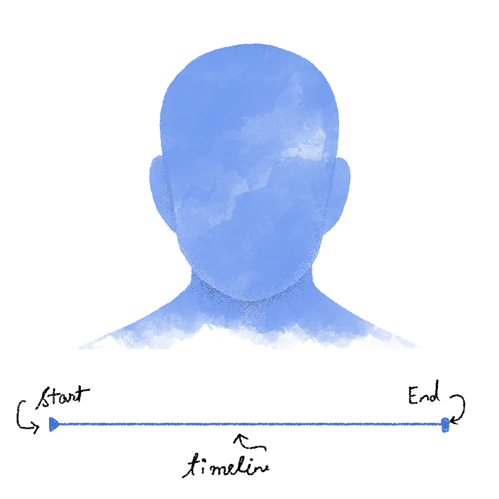
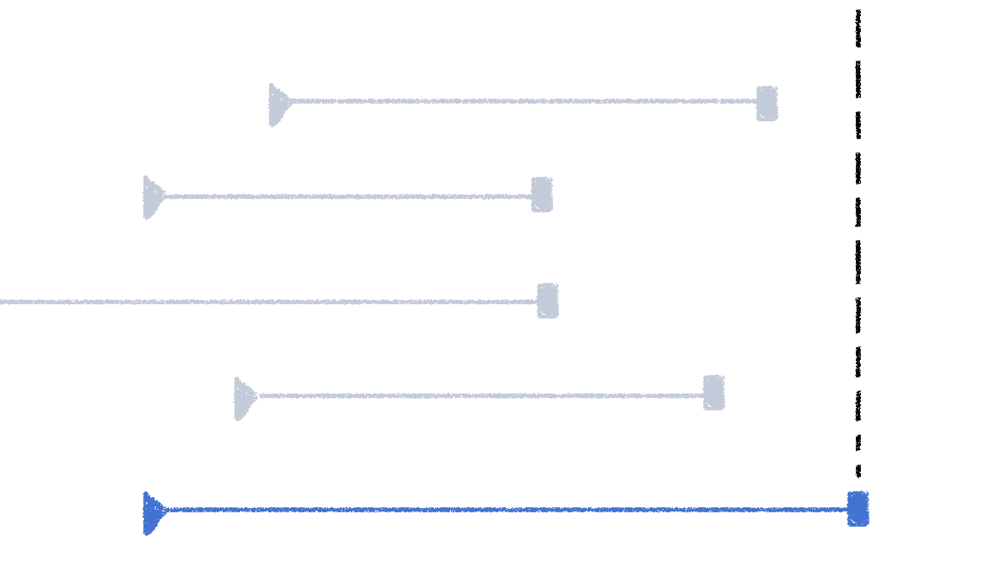
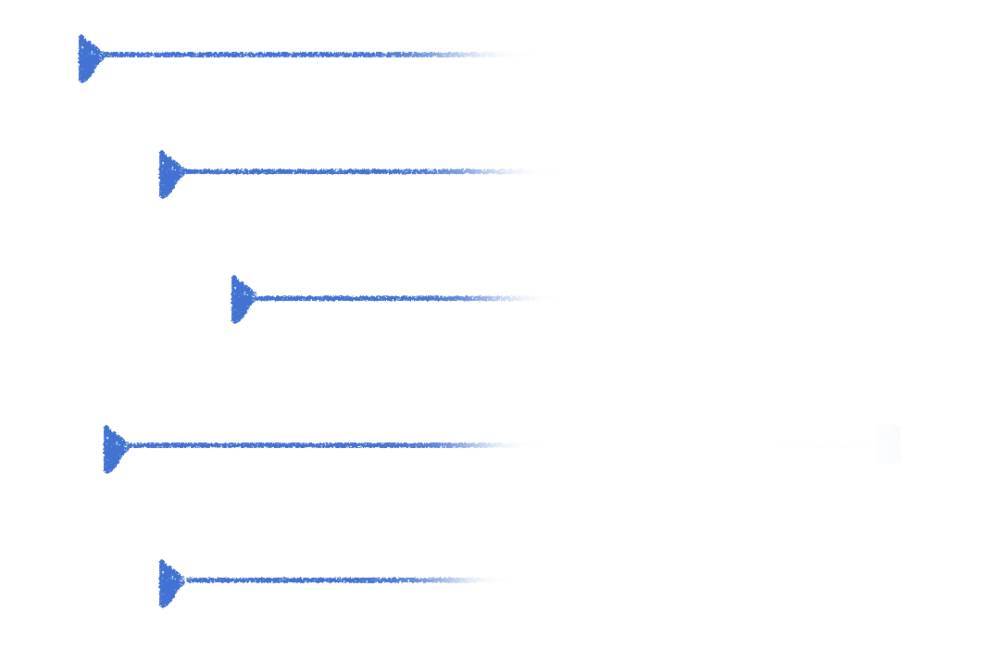

---
keywords:
- philosophy
- impermanence
- temporary
- pain
- sorrow
- what is impermanence
- help
title: "Understanding impermanence"
date: 2019-05-15
path: "/blog/impermanence"
featuredImage: ./images/cover.png
---
It is said an Eastern monarch once charged his wise men to invent him a sentence, to be ever in view, and which should be true and appropriate in all times and situations. They presented him the words: ‘And this, too, shall pass away.’ How much it expresses! How chastening in the hour of pride! —how consoling in the depths of affliction! ‘And this, too, shall pass away. - *Abraham Lincoln*

A couple of months ago I was at a Pizza Hut in a city I had never been to before. It was 2 in the afternoon and I was having a 3-course meal. Now I don’t know if having a 3-course meal at a Pizza Hut is weird but I am going to be honest with you. I had soup, then Pizza along with Potato Wedges and then a Chocolate Brownie. All by myself. One beautiful thing about eating alone is that sooner or later, without you even realizing, you drift into your own thoughts.

"There's something off about **this too, shall pass**", I thought as I pulled the first slice of pizza away from the whole. The dripping cheese almost crossed over the edge of the plate and onto the table. Then, by the time I had wiped the last little bits of Chocolate Brownie off my lips, I knew exactly what this advice gets wrong.

"This too, shall pass", says whatever "this" it is referring to is impermanent. Impermanent means something that won't exist forever. Now, let's start breaking things down a bit. Of the things that end, there are two types: 

1. **Things that you want to end** e.g. poverty, a disease, a disability, a bad boss, a bad mental state, a professor that won't let you pass your university, or, 
2. **Things that you don't want to end** e.g. a good relationship, a life of a close friend, a thriving career e.t.c

It's when the things you don't want to end suddenly come to a halt, hurt is born.

To get around this hurt, or in an attempt to "make it easy", a widely dispensed piece of advice is to accept that everything is temporary, or, this too, shall pass. Every time I hear this it makes me a little uneasy because there are people suffering from poverty, disabilities, and other misfortunes. A good number of them will never get cured, they'll die poor, diseased and sad. I am sorry, but that's life. So telling someone "everything is temporary" which includes their misfortunes, is outright absurd and to some degree, untrue. It's just not that simple, is it?. Let's see how.

To start off we'll need to define **Timeline**. A Timeline is a slice of time between which something starts, exists and then ends. You have a Timeline, which started with your birthday, will be as long as the number of years you'll live and then end when you die. 

It's just not you, everything you see, touch, feel, everything you know or don't know anything or anyone that has existed, exists or will exist has a Timeline. The device you're reading this on has a Timeline, the bed or chair you're sitting on too, have Timelines, a start (&#9658;) and an end(&#9726;).

With that knowledge in our heads, we can now more concretely define "temporary (impermanent)" and "permanent". 

Whenever we call something temporary or permanent we always talk relative to a Timeline. So something is temporary *for you* if its Timeline ends before your Timeline.

And similarly, something is permanent for you if its Timeline stretches beyond your Timeline or ends exactly when your Timeline ends.



But the reality is just a *little* more complex than that. In reality, there is no way to reliably know the end of a Timeline. So in real life Timelines look something like this.

\

Because we cannot reliably predict the end of something, there is no way to absolutely know if something is temporary or permanent. Hence, the argument "Everything is temporary" falls right off the wall. Because if I can say "Everything is temporary", I can also confidently say "Everything is permanent", which is absurd, it's just making assumptions. Your friendship with your best friend might last as long as you do, and so can your disability or your financial condition or a strained relationship. How does that sound?

I don’t expect my 5 minutes of logic that I conjured while eating Pizza to stand against years old wisdom. Maybe there are faults in my argument that I don’t see right now, or maybe there are none, “Everything is temporary” or “This too, shall pass” are flawed arguments. But you know what? It doesn’t matter. The one thing we understand from religion, myth, and stories is that something doesn’t have to be true as long as it gives hope and makes life bearable.

Believing that everything is temporary does exactly that. If you’ve spent even a few years in adulthood you know life from a distance is broadly a collection of highs and lows. During the highs, I think this advice works particularly well because it stops you from getting attached. Because [attachment](https://www.instagram.com/p/BtAw2pWnrc6/) to anything, sooner or later, turns into poison. During the lows, this advice gives you hope to continue because the loss of hope is essentially death. So logically sound or not, **"this too, shall pass"** is a solid piece of advice.
