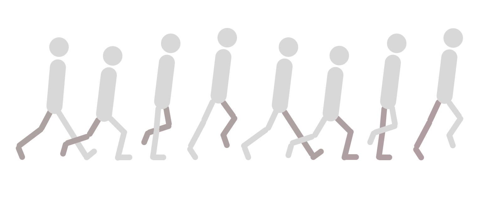
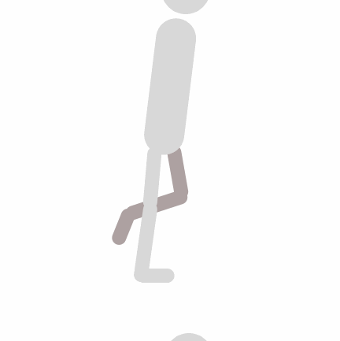
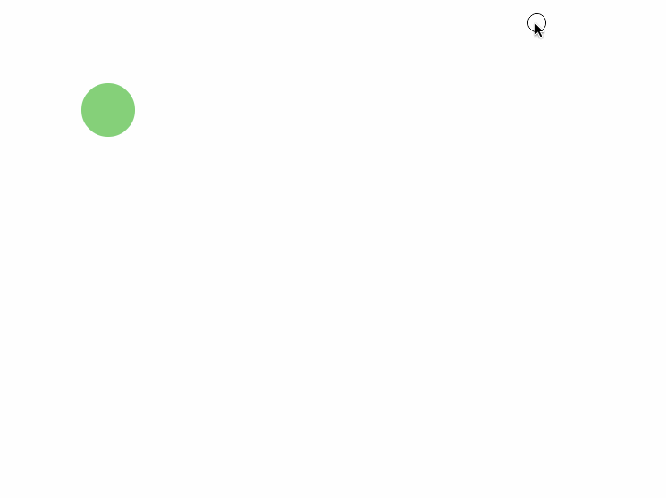

In traditional (hand-drawn) animation, a senior or key artist draws keyframes that define the motion.

An assistant, generally an intern or a junior artist, then draws the necessary inbetweens for the scene. The job of the assistant, also called an inbetweener, is to make transitions between key poses look smooth and natural.


Inbetweens are necessary since animations without them appear choppy. Unfortunately, drawing in-betweens is more or less grunt work. But it’s the twenty-first century, and we have computers that can handle this type of task.



Remember what teachers told you in grade school about computers being dumb? Computers need to be told the exact sequence of steps to perform an action. Today we’ll look at one such sequence of steps, or algorithm, that helps the computer draw necessary inbetweens to create a smooth animation.

I’ll be using HTML5 canvas and JavaScript to illustrate the algorithm. However, you’ll be able to read and understand the article even if you aren’t familiar with them.

## Intent
<br/>


Our goal is simple, to animate a ball from point A`(startX, startY)` to B `(endX, endY)`.


If this scene were passed to a studio that does traditional animation, the senior artist would draw the following key poses…


…and then pass the drawing board to a junior artist to draw inbetweens like so.


For our situation, there is no animation studio nor do we have junior artists. All we have is a goal, a computer, and the ability to write some code.

## Approach
<br/>


The HTML code is simple, we only need one line.

```html
<canvas id=”canvas”></canvas>
```

This part of the JavaScript code (shown below) simply grabs `<canvas/>` from the Document Object Model (DOM), gets [context](https://developer.mozilla.org/en/docs/Web/API/CanvasRenderingContext2D), and sets the width and height property of the canvas to match the viewport.

```js
const canvas = document.getElementById(‘canvas’),  
  context = canvas.getContext(‘2d’),  
  width = canvas.width = window.innerWidth,  
  height = canvas.height = window.innerHeight;
```

The function below draws a green solid circle of radius `radius` at `x` and `y` coordinates.

```js
function drawBall(x, y, radius) {  
  context.beginPath();   
  context.fillStyle = ‘#66DA79’;  
  context.arc(x, y, radius, 0, 2 \* Math.PI, false);  
  context.fill();  
}
```

All of the above code is boilerplate to set up our animation, here’s the juicy part.

```js{9,13}
// Point A  
let startX = 50, startY = 50;

// Point B  
let endX = 420, endY = 380;

let x = startX, y = startY;

update();
function update() {  
  context.clearRect(0, 0, width, height);  
  drawBall(x, y, 30);  
  requestAnimationFrame(update);
}
```

First of all, notice the `update` function being called right above its declaration. Second of all, notice `requestAnimationFrame(update)` which calls `update` _repeatedly_.


Flipbook animation is a good analogy for the kind of program we’re writing. Just like repeatedly flipping through a flipbook creates the illusion of motion, repeatedly calling the `update` function creates the illusion of motion for our green ball.

One thing to note about the code above is that “update” is just a name. The function could have been named anything else. Some programmers like the names `nextFrame`, `loop`, `draw`, or `flip` because the function is repeatedly called. The important part is what the function does.

On each subsequent call of `update`, we expect the function to draw a slightly different image on the canvas than the previous one.


Our current implementation of `update` draws the ball at the same exact position on each call `drawBall(x, y, 30)`. There is no animation, but let’s change that. Below is a [pen](http://codepen.io/nashvail/pen/XRNprQ) that contains the code we have written so far, you can open it and follow along.


On each iteration of `update` let’s go ahead and increment the value of `x` and `y` and see the kind of animation it creates.

```js{4}
function update() {  
  context.clearRect(0, 0, width, height);  
  drawBall(x, y, 30);  
  x++; y++;
  requestAnimationFrame(update);  
}
```

Each iteration moves the ball forward in both the x and y directions, and repeated calls of `update` results in the animation as shown.



Heres’ the deal though, our intent was to move the ball from a start position to an _end position_. But we’re doing absolutely nothing about stopping the ball at an end position. Let’s fix that.

One obvious solution is to only increment the coordinates when they are smaller than `endX` and `endY` values. This way, once the ball crosses `endX, endY` its coordinates will stop updating and the ball will stop.

```js{4-8}
function update() {  
  context.clearRect(0, 0, width, height);  
  drawBall(x, y, 30);  
   
  if(x <= endX && y <= endY) {  
    x++;  
    y++;  
  }
   
  requestAnimationFrame(update);  
}
```

There’s an error in this approach though. Do you see it?

The problem here is that you cannot make the ball reach _any_ end coordinate you want just by incrementing `x` and `y` values by `1`. For example, consider end coordinates `(500, 500)`, of course if you start at `(0, 0)` and add `1` to `x` and `y`, they will eventually get to`(500, 500)`. But what if I chose `(432, 373)` as end coordinates?

Using the above approach, you can only reach points lying in a straight line 45 degrees from the horizontal axis.


Now you can use trigonometry and fancy math to calculate precise amounts that `x` and `y` should be incremented by to reach any coordinate you want. But you don’t need to do that when you have linear interpolation.

## Approach with linear interpolation
<br/>


Here’s what linear interpolation function a.k.a `lerp` looks like.

```js
function lerp(min, max, fraction) {  
  return (max — min) * fraction + min;  
}
```

To understand what linear interpolation does, consider a slider with a `min` value on the left end and a `max` value on the right end.


The next thing we need to choose is `fraction`. `lerp` takes `fraction` and converts that to a value between `min` and `max`.


When I put `0.5` in the `lerp` formula — no surprises — it translates to 50. This is exactly the halfway point between `0` (min) and `100` (max).

Similarly, if we choose another value for `fraction` say `0.85`…


And if we let `fraction = 0`, `lerp` will output `0` (min) and on `fraction = 1`, `lerp` will produce `100` (max).

I chose 0 and 100 as `min` and `max` to keep this example simple, but `lerp` will work for any arbitrary choice of `min` and `max`.


For values of `fraction` between `0` and `1`, `lerp` allows you to _interpolate_ between `min` and `max`. Or in other words, traverse between `min` and `max` values, where choosing `0` for `fraction` puts you at `min`, choosing `1` puts you at `max` and for any other value between `0` and `1`, puts you anywhere between `min` and `max`. You can also see `min` and `max` as key poses, like in traditional animation, and `lerp` outputs as inbetweens ;-).

Alright, but what if someone gives a value outside the bounds of `0` and `1` as `fraction` to `lerp`? You see the formula for `lerp` is extremely straightforward with most basic of mathematical operations. There’s no trick or bad values here, just imagine extending the slider in both directions. Whatever value for `fraction` is supplied, `lerp` _will_ produce a logical result. We shouldn’t pay much thought to bad values here though, what we should think about is how all of this maps to animating the ball.

If you’re following along go ahead and change the `update` function to match the following code. Also don’t forget to add in the `lerp` function we defined at the beginning of this section.

```js{4-5}
function update() {  
  context.clearRect(0, 0, width, height);  
  drawBall(x, y, 30);  
  x = lerp(x, endX, 0.1);  
  y = lerp(y, endY, 0.1);
  requestAnimationFrame(update);  
}
```

Here’s a [pen](http://codepen.io/nashvail/pen/wdjpVZ) of what our program looks like now. Try clicking around :)

https://codepen.io/nashvail/pen/wdjpVZ

Smooth right? Here’s how `lerp` helps to improve the animation.

In the code, notice the variables `x` and `y` — which are initially set to `startX` and `startY`— mark the current position of the ball in any frame. Also my choice of `0.1` as `fraction` is arbitrary, you can choose any fractional value you want. Keep in mind that your choice of `fraction` affects the speed of the animation.

In every frame `x` and `endX` are taken as `min` and `max` and interpolated with `0.1` as `fraction` to obtain a new value for`x`. Similarly `y` and `endY` are used as `min` and `max` to obtain a new value for `y` using `0.1` as fraction.


The ball is then drawn at the newly calculated`(x, y)` coordinate.


These steps are repeated until `x` becomes `endX` and `y` becomes `endY` in which case `min = max`. When `min` and `max` become equal `lerp` throws the exact same value(min/max) for any further frames thus stopping the animation.

And that is how you use linear interpolation to smoothly animate a ball.

This short article covers a lot. We started by defining terms like key poses and inbetweens. Then we tried a trivial approach for drawing inbetweens and noticed its limitations. Finally, with linear interpolation, we were able to achieve our intent.

I hope all the math made sense to you. Feel free to play with linear interpolation even more. This article was inspired by [Rachel Smith](https://medium.com/u/4c544b7a59b)’s [post on CodePen](https://codepen.io/rachsmith/post/animation-tip-lerp). Rachel’s post has many more examples, be sure to check it out.
