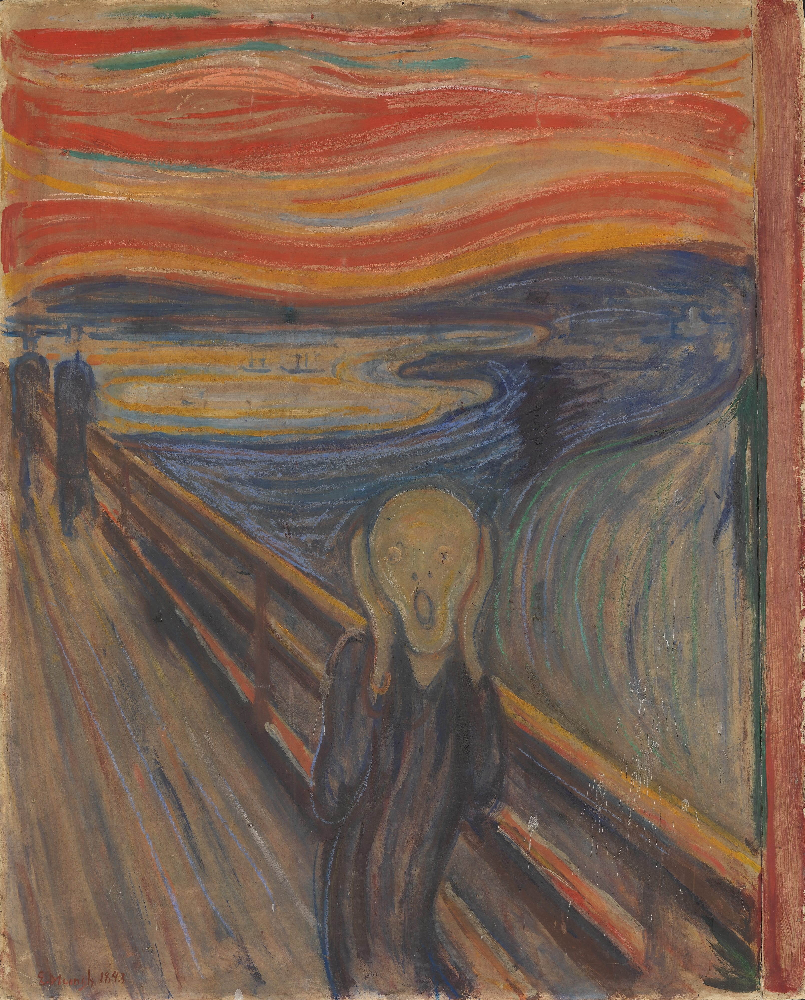
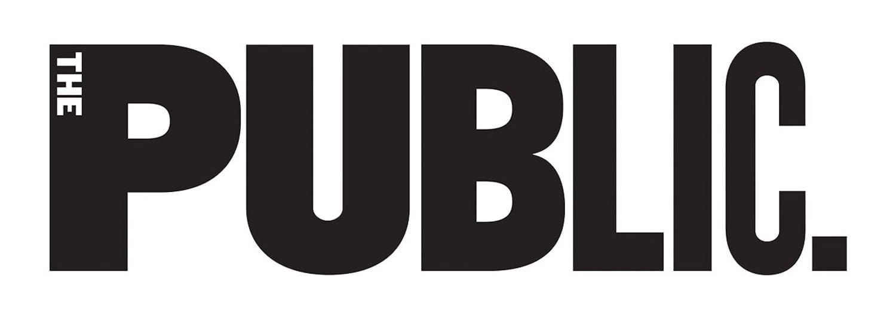
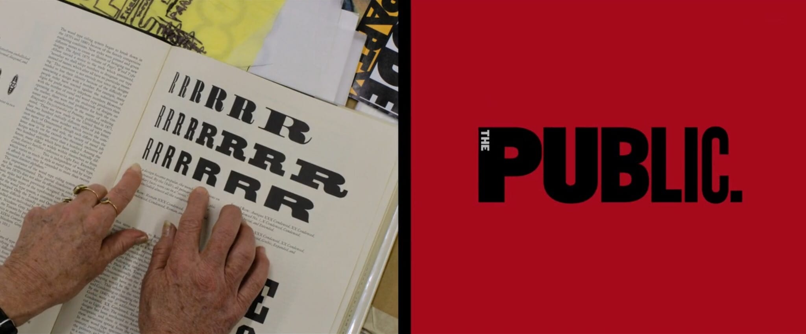
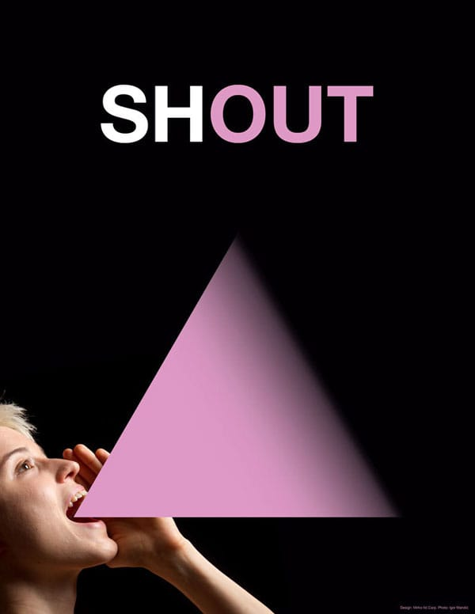
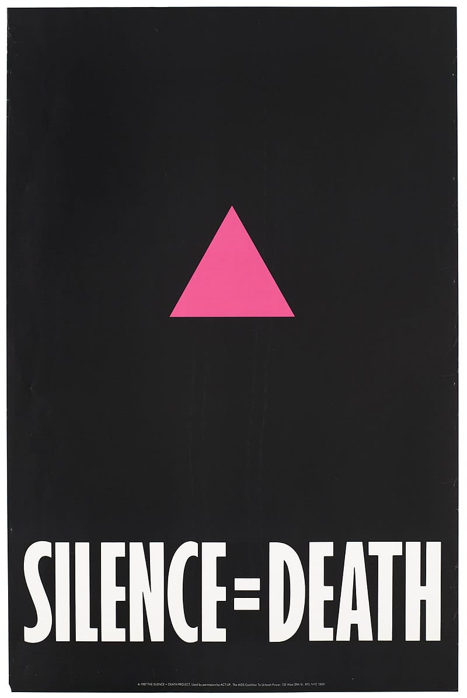

---
keywords:
- design
- designer
- thinking
- illustration
- muzli
- invision
title: "Designers, maybe inspiration is the wrong word"
description: Why the words inspiration and inspire have lost their meaning in the design community.
date: 2019-03-03
path: "/blog/problem-with-inspiration"
featuredImage: ./images/cover.png
categories:
- design
---

“I was walking along the road with two friends – the sun was setting – suddenly the sky turned blood red – I paused, feeling exhausted, and leaned on the fence – there was blood and tongues of fire above the blue-black fjord and the city – my friends walked on, and I stood there trembling with anxiety – and I sensed an infinite scream passing through nature.”

The volcanic eruption of Krakatoa that lit the sky in a fiery spectacle, or in the words of Edvard Munch, "an infinite scream passing through the nature", inspired The Scream. One of the most iconic paintings we know today.

On the 11th of September 1907, Emily Dimmock a part-time prostitute cheating on her partner was murdered in her home at Camden Town. The artist Walter Sickert had spent the summer of 1907 working at studios in Mornington Crescent, a mile away from Camden Town. The murder's proximity and his fascination with it inspired Sickert to produce a set of 4 paintings titled [The Camden Town Murder](https://en.wikipedia.org/wiki/The_Camden_Town_Murder).

There’s nothing new about artists deriving inspiration from nature, or a person, a crisis or joy or an event and turning that into a painting, a poem or a film. It’s a beautiful mystery how something can instill in us an urge to create. Inspire us, in the truest sense.

I am a designer. “Inspire” and "inspiration" are the words that climb into my ears and shoot through my eyes more than I would like, daily. Whether it's "looking for inspiration" online or coming across videos and articles with "top 5 sites to find design inspiration". I won't lie, I love them and I love collecting and soaking my brain in the work that I find good. There is absolutely nothing wrong with this practice. I, for one judge a designer's seriousness towards their craft based on whether or not they have hoarded screenshots of designs that either made them jealous or go WOW! The only thing, though, that I find off-putting is the blatant use of the word "inspiration". 

Allow me to explain.

Here's one of my favorite graphic designs. The Public Theatre logo.

It’s dynamic. It’s hip. It’s everything. Paula Cher designed it. As we go behind the scenes with Paula in the Netlifx Documentary, Abstract: The Art of Design, we come to know that the inspiration--if I should say--for the design of the public theatre logo --notice the Rs-- came from this page in the book, American Woodtype.

It's true, each time a new project is to be started, I find myself sifting through Dribbble and Behance in hopes of finding some momentum or a starting point. A shoulder to stand on. To research is a good habit. And Paula stumbling upon a graphic--that provided a base for the logo to build upon--while flipping through a book, is a result of the same habit. 

If we're to say that Paula found inspiration for the design of the public theatre logo in the Rs, we're also saying that the Rs *inspired* the public theatre logo. Now to me that doesn't feel quite right, especially when put in contrast with how "the scream of nature" *inspired* The Scream and how an abhorrent crime *inspired* The Camden Town Murder series of paintings.

Let's look at another example. Mirko Ilić designed this marvelous poster for the Gay Pride Parade.

It's filled with references to earlier works by other artists. One of which clearly is the reference to the Silence=Death poster. 

The prominent pink triangle you see in both the posters is there for a reason. The Nazis used the pink triangle as a badge to distinguish homosexual men. This symbol since then has been reclaimed as a positive symbol of self-identity. And because every great designer and artist I have read about is a big time hoarder and researcher, I would assume Mirko already had the Silence = Death poster in his collection. He knew about the significance of the pink triangle. So when an opportunity to use all of that came along, he did.

Yet again the question that I ask is, is it correct to say that the Silence=Death poster *inspired* Mirko's poster?

Inspiration and inspire are big words. To Inspire means to fill with an urge to express, to create, to give the voice inside of you a way to escape. That is the literal English definition. When you know this, and think about it, its daily use in the design community does feel flimsy. So if "inspiration" and "inspire" are not the right words, then what is?

[Melodrama](https://open.spotify.com/album/2B87zXm9bOWvAJdkJBTpzF?si=SFuUnCnlT0qb2A2dQOGDjQ) is the second studio album by Lorde.  Melodrama is a beautiful creation, turning every detail of heartbreak into music in a way that's never been done before. I am also a fan of The 1975, so when YouTube recommended [Lorde covering "Somebody else", a The 1975 song](https://www.youtube.com/watch?v=rIRCjztMI7k). I had to watch it, over and over again. I am telling you about this because in the cover's introduction Lorde says "This [Somebody else by The 1975] is a song that I really really love. This was one of my favorite songs from last year and it really **influenced** Melodrama, it **influenced** the tones and the colors and the emotions."

That's when it hit me.

Influence.

The blood red sky *inspired* The Scream.  
The murder *inspired* the Camden Town Murder paintings.  
The Rs *influenced* the design of the public theatre logo.  
The Silence = Death poster *influenced* Mirko's poster.  
The design from Dribbble that you collected in your mood board, *influenced* your design. It did not inspire it.

If you agree with the above 5 expressions, then you will also agree that "looking for inspiration" or "finding inspiration" or anything that has the word "inspiration" weaved in, in context of design, does not fit. To use the word "inspire" or "inspiration" is to try and fill big shoes. A prevailing problem can inspire an app or a business to be created. A tragedy can inspire a painting. An encounter can inspire a poem. But looking at other designer's works cannot *inspire* your design, it can only influence it. All of this doesn't mean I'll stop using the word inspiration, it has become a norm. It is how designers address references and pieces that influenced their design, it's okay if it remains that way. I had an itch which now has been shared and also, properly scratched.

