---
keywords:
  - css
  - html
  - web
  - web development
  - nash
  - nash vail
  - pseudo classes
  - pseudo
title: "How CSS pseudo-classes work"
path: "/blog/pseudo-classes"
date: 2016-06-11
description: "A visual explanation of pseudo classes, so that you don't ever have to set background red again while writing them."
categories:
  - code
---

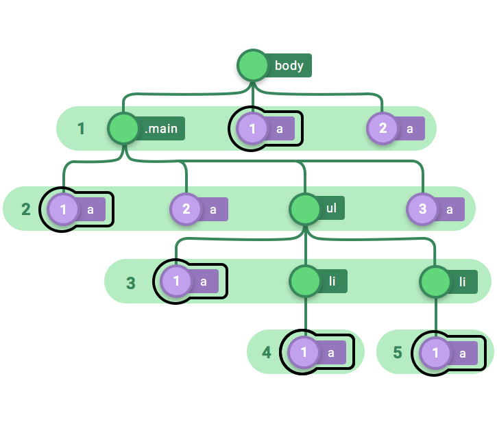

Let’s be honest — there are times when CSS can really hurt your brain. It’s hard enough to center an element inside its parents.

Today, we’re going to make sense of an even more challenging aspect of CSS: pseudo-classes.

<center>
  <figure>
    
    <figcaption class="gatsby-resp-image-figcaption">Obligatory Family Guy GIF</figcaption>
  </figure>
</center>

The pseudo-classes I’ll cover here come in two flavors.

- *-of-type selectors
- *-child selectors

You may be thinking, “But I’m here to learn pseudo-classes. Why are we talking about selectors?” Well, these are basically the same thing, and I will use these terms interchangeably.

Pseudo-classes are sometimes hard to grasp, mainly because they’re presented in an abstract way. So I’ll take a different approach here and help you understand these by drawing a DOM tree.

## The Markup and The Tree

<br/>

First, take a look at this block of HTML. I’ll use this code in all my examples.

```html
<body>
  <div class="”main”">
    <a href="”#”">Inner Link 1</a>
    <a href="”#”">Inner Link 2</a>
    <ul>
      <a href="”#”">Inner Inner Link 1</a>
      <li>
        <a href="”#”">List Item 1</a>
      </li>
      <li>
        <a href="”#”">List Item 2</a>
      </li>
    </ul>
    <a href="”#”">Inner Link 3</a>
  </div>
  <a href="”#”">Outer Link 1</a>
  <a href="”#”">Outer Link 2</a>
</body>
```

Now I’m going to convert this code into something more visual and more intuitive: a tree.

The following body element has 3 children, `.main` and two `anchor` elements.

```html
<body>  
  <div class=”main”>  
   ...  
  </div>  
  <a href=”#”>Outer Link 1</a>  
  <a href=”#”>Outer Link 2</a>  
</body>
```

Here’s what the relation between `body` and its three children looks like when you is represent it as a tree:

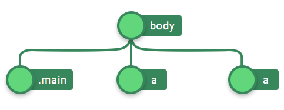

One thing to keep in mind is that the order in which children are placed in the tree is important. Children located top to bottom in code are placed left to right in the tree.

Next, let’s look at the `.main` div:

```html
<div class=”main”>  
   <a href=”#”>Inner Link 1</a>  
   <a href=”#”>Inner Link 2</a>  
   <ul>  
     ...  
   </ul>  
   <a href=”#”>Inner Link 3</a>  
</div>
```

`.main` has 4 children. The first two are `anchor` elements then an `ul` and then again an anchor elements.

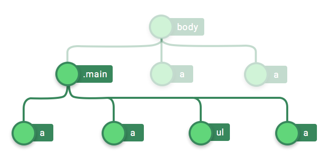

Similarly, we step down each level of nesting and draw the complete tree out of the HTML code.

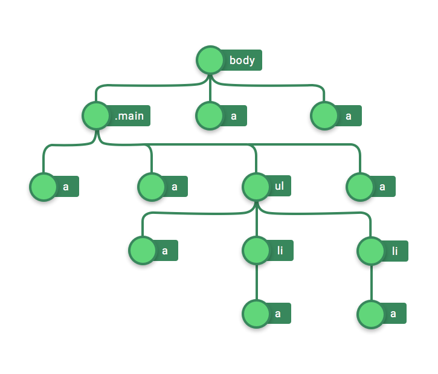

In order for this article to bear any fruit for you, it’s important that you understand this tree.

“Ha ha nice pun there!” “Thanks!” Increment the pun counter to 1, and let’s move to our very first pseudo-class.

## Pseudo-class #1 :only-of-type
<br/>

All pseudo-classes follow the same format:

```
what-you-want-to-select:filter { /* styles */ }
```

`what-you-want-to-select` can be used to select anything that exists as a collection in the DOM. Here, allow me to go ahead and show you an example:

```css
a:only-of-type {  
 border: 2px solid black;  
}
```

In the code snippet shown above, `what-you-want-to-select` are anchor elements (the `a` tag), and the `filter` is `only-of-type`. We’ll see in a moment what this selector does.

First, I’ve setup a [codepen](http://codepen.io/nashvail/pen/VKkXLB) for if you’re too lazy to create a tester project. You’re welcome, friend!

You can follow along, see the changes, get confused, then come back to this article for the explanation. You do your part, I’ll do mine.

Here’s me doing my part, explaining the code shown above. We’ll start by selecting everything that there is, and then eventually filter down.

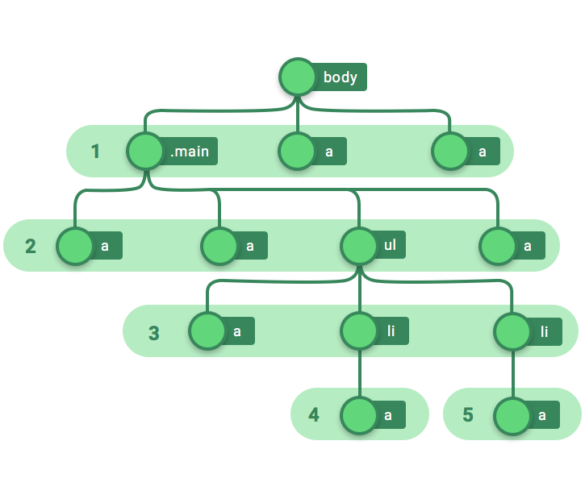

Notice how the selection has been done? Each section in the tree (numbered 1 to 5) has elements with a common parent. The parent of Section 1 is `body`, the parent of Section 2 is .`main,` and so on. **Once again, notice that each section corresponds to a level deeper in code nesting**.

Next, since anchor elements are `what-you-want-to-select`, we’ll do just that:

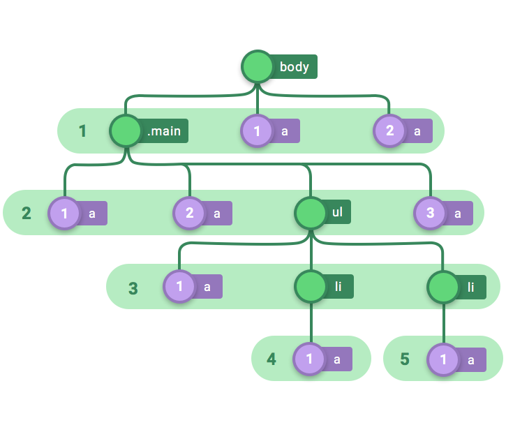

We’ve selected all the anchor element in each of the sections and numbered them consecutively left to right. And I mentioned, the order — left to right — is important.

This is where `what-you-want-to-select` part ends and the filtering begins.

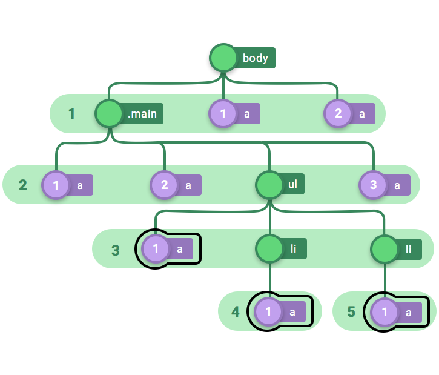

`only-of type` traverses each section and selects only those anchor elements that are the only anchor element in their respective section. Notice how sections 3, 4, and 5 are the only sections with anchor elements? As figure 6 shows, these are the ones that get selected and declared when a style gets applied.

## Pseudo-class #2 :first-of-type
<br/>

Let’s fast forward to the part where we end selecting all the `what-you-want-to-select`s (anchor elements in our case).


The filter `first-of-type` translates to selecting in each of the sections only the first occurrence of the anchor element.


Here’s what the code that accomplishes this looks like:

```css
a:first-of-type {  
 border: 2px solid black;  
}
```

In case you forgot the hard work I did for you setting up the CodePen, here’s the [link](http://codepen.io/nashvail/pen/VKkXLB) again to check out what the code renders in a browser.

## Pseudo-class #3 :last-of-type
<br/>

If you can’t tell by the name, `last-of-type` is the exact opposite of `first-of-type`. Which therefore means in each section of the tree, instead of selecting the first occurrence, select the last ones.


“What about the sections with just one anchor element?”, not very glad you asked that question. It’s quite simple to see if a section has just one anchor element, it obviously passes the `only-of-type` filter, but not only that. Since there are no anchor elements preceding or following that particular tag it passes both `first-of-type` and `last-of-type` filters as well (e.g `a` tags Section 4 and 5).

## Pseudo-class #4 :nth-of-type
<br/>

And now we finally bite into the juicy part of the article, there’s simple CSS with some fifth grade Math toppings, hope you enjoy savouring it.

Let’s declare the following style to begin with.

```css
a:nth-of-type(1) {  
 border: 2px solid black;  
}
```

It looks a little cryptic but is quite simple really. To read the selector simply take the number from the parentheses and replace `nth` in the selector name with that number’s **ordinal** form.

Alright coming back, `a:nth-of-type(1)` can be therefore read as `a:first-of-type` and no surprise it works exactly like `a:first-of-type` and results in the elements getting selected as shown below; just the anchor elements which are first of their types in their respective section.


Well that is fine and dandy, but let’s try something different here.

```css
a:nth-of-type(0) {  
 border: 2px solid black;  
}
```

If you guessed it right, which I am sure you didn’t, no anchor elements get selected in this case. As the numbering of types (and children as we’ll see) in each section starts from 1 and not 0, there is no “0” anchor elements in any of the sections and therefore `a:zeroth-of-type` selects nothing. And so will be the case for `a:nth-of-type(5)` or `a:nth-of-type(6/7/8)` because there are no `a:fifth-of-type` or `a:sixth/seventh/eighth-of-type` in any of the sections*.*

But if we went ahead and used…

```css
a:nth-of-type(2) {  
 border: 2px solid black;  
}
```

… quite clearly sections 1 and 2 have a `second-of-type` anchor elements and hence those are the ones that get selected.

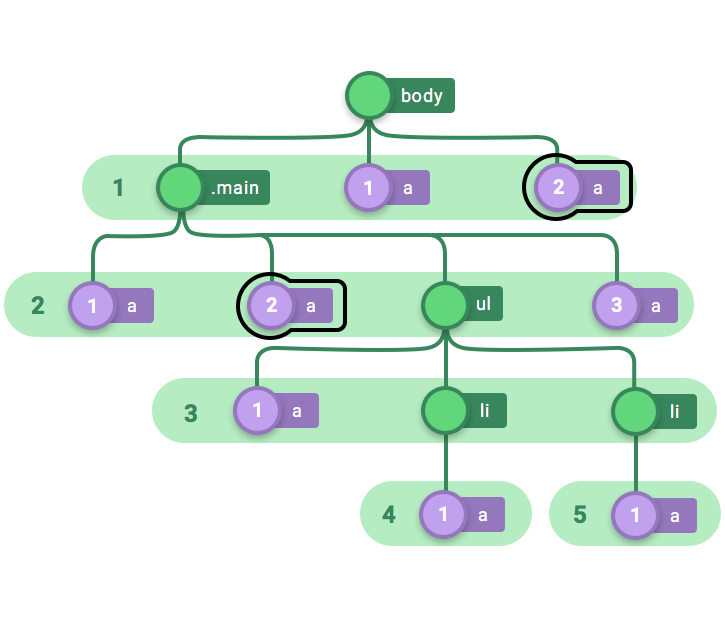

Similarly, just to reinforce the point here, if we went ahead and declared the following style,

```css
a:nth-of-type(3) {  
 border: 2px solid black;  
}
```

it will select the third anchor elements in the second section as section 2is the only section with a :`third-of-type` anchor element.

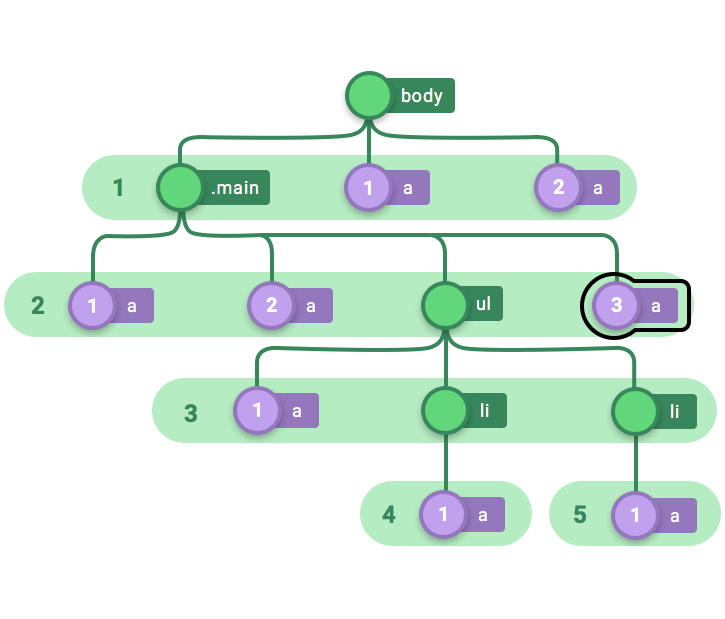

Quite simple isn’t it? But numbers aren’t the only thing that you can pass into `:nth-of-type(…)` this bloke is more powerful that that, you can also pass in formulas of form `(a * n) + b` (or for brevity `an + b`)`.` Where `a` and `b` are constants and `n` is a value >= 0. How did you like the Math topping sir? don’t worry it’ll all make sense in a second.

Consider the following style

```css
a:nth-of-type(n) { border: 2px solid black; }
```

The formula that’s passed in the selector above is `(1 * n) + 0 [= n] `, `a` is 1, b is 0 and `n` is well, n. What happens next is, starting from 0 the numerical value of `n` is incrementally plugged into the formula and selection is made. Therefore `a:nth-of-type(n)` basically translates to

```css
a:nth-of-type(0) { border: 2px solid black; } /* n = 0 */
a:nth-of-type(1) { border: 2px solid black; } /* n = 1 */
a:nth-of-type(2) { border: 2px solid black; } /* n = 2 */
a:nth-of-type(3) { border: 2px solid black; } /* n = 3 */
a:nth-of-type(4) { border: 2px solid black; } /* n = 4 */
```

Hence this results in all the anchor elements getting selected.

Let’s consider one more example

```css
a:nth-of-type(2n + 1) { border: 2px solid black; }
```

Starting from 0 and incrementally plugging values of `n` in the formula generates the following selectors.

```css
/* n = 0 implies (2 * 0) + 1 = 1 */
a:nth-of-type(1) { border: 2px solid black; }

/* n = 1 implies (2 * 1) + 1 = 3 */
a:nth-of-type(3) { border: 2px solid black; }

/* n = 2 implies (2 * 2) + 1 = 5 - No selections since no fifth-of-type present in any of the sections */
a:nth-of-type(5) { border: 2px solid black; }...
```

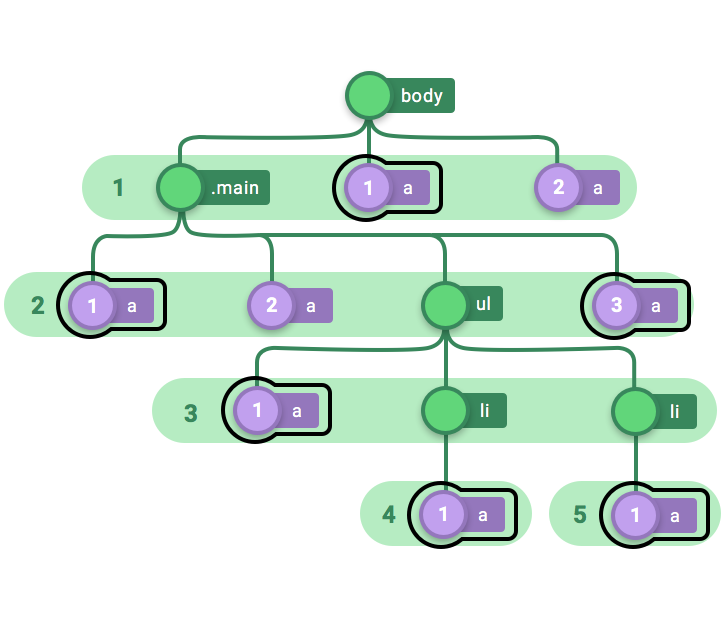

Other than numbers and formulas that *generate numbers*, you can pass in either `even` or `odd` strings. `even` selects all the even occurrences of an element of particular type in a section i.e `:second-of-type :fourth-of-type :sixth-of-type` e.t.c and on the other hand obviously `:nth-of-type(odd)` selects all the odd occurrences i.e `:first-of-type, :third-of-type, :fifth-of-type` e.t.c

## Pseudo-class #5 :nth-last-of-type
<br/>
This selector functions exactly like the previous one, but with one little difference. See for yourself...

```css
a:nth-last-of-type(1) { border: 2px solid black; }
```

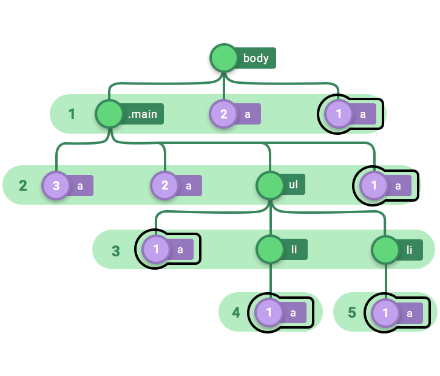

Notice how in each level numbering of anchor types is done from right to left instead of normal left to right. That is the only difference. `last-of-type` accepts numbers and formulas and even/odd just like `nth-of-type` except when selection is made the last type is treated as first, second last as second, third last as third and so on…

With that we come to an end of `*-of-type` selectors. Hope it was a fun ride for you, we started with `only-of-type` then moved to `first-of-type`, `last-of-type` and took a huge dip into `nth-of-type(…)` and `nth-last-of-type(..).` If in case somewhere in the middle you lost your grip and fell off I encourage you play around with this pen and re read the explanation.

https://codepen.io/nashvail/pen/VKkXLB

Alright, time to hop on to the next one in this less visited corner of the CSS theme park. Another category of pseudo selectors/classes we’re going to delve into are `*-child` classes. With a clear understanding of how `*-of-type` selectors work grasping the concept behind `*-child` selectors should be a cinch for you. “Cinch? What’s that? Is it a unit of measurement?” No, it means an extremely easy task. Anyway, let’s start with our very first `*-child selector`, :`only-child`.

## Child pseudo-class #1 :only-child
<br/>

Consider the following style.

```css
a:only-child {  
 border: 2px solid black;  
}
```

Now that’s the very definition of self explanatory and straightforward. The selector says to select all the anchor elements, given that the anchor element should be the only child of its parent, or, to put in other words select all the anchor elements whose parent has just one child and that one child is an anchor element.

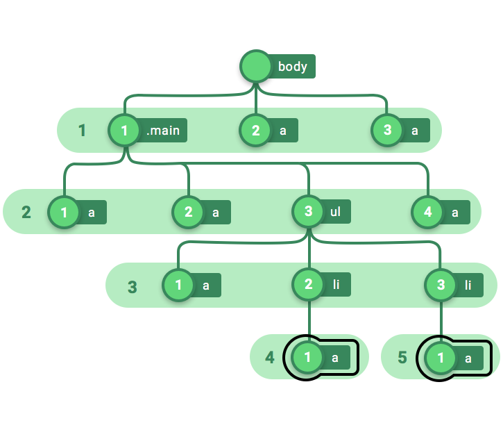

I had a friend who was never his mother’s favorite, and he was an only child. Just wanted to plug that in there, anyways, notice that in contrast with `*-of-type` selectors we are no longer numbering types, but children, starting of course from 1 (and not 0). When compared with `only-of-type`, the anchor element in section 3 is not selected as its parent (`ul`) has 3 children therefore even though it (the anchor element in level 3) is an `only child of type ‘a’` of its parent, its not the only child, there are 2 `li`s as well.

## Child pseudo-class #2 :first-child
<br/>

Consider the following style declaration.

```css
a:first-child {  
 border: 2px solid black;  
}
```

It simply says, select all the anchor element, but with one condition in mind, the anchor element should be the first child of its parent. That’s it, no further explanation needed.

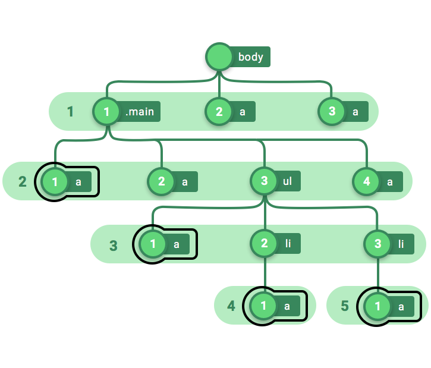

For if you are a little confused as of why the `a` in section 1 wasn’t selected it’s because the first child in section 1 (whose parent is `body`) is `.main`, the first `a` in section 1 is the second child and couldn’t pass the `first-child` filter, that is the exact reason why the poor bloke ended up not being selected and was given a big hashtag fuck off. Let’s continue to the next one.

## Child pseudo-class #3 :last-child
<br/>

This is the part where selectors should start to get self explanatory and you should start thinking I am dumb trying to explain them to you. [But my name is not blurryface and I don’t care what you think](http://genius.com/6273352). “Nice twenty one pilots reference there” yeah I know, thanks. Now, look at the following style declaration.

```css
a:last-child {  
 border: 2px solid black;  
}
```

`what-you-want-to-select` ? “Anchor elements.” And the `filter` you want to use? `last-child.` That quite simply translates to select those anchor elements which are the last child of their parent. Or, in other words select anchor elements whose parent finally decided it wasn’t fun anymore and stopped after that bloke was born. Below is what the tree looks like with `:last-child` selections.

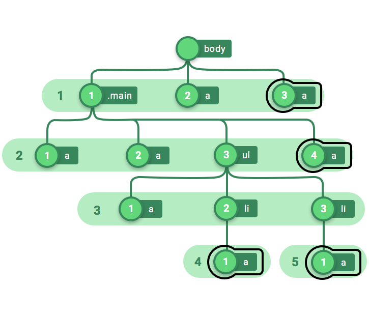

## Child pseudo-class #4 :nth-child
<br/>

I hope you were able to digest the Math topping you got served last time, because it’s about to happen again only this time on a slightly different crust.

Now, I would like you to take all your attention and laser point it to the following example.

```css
a:nth-child(1) { border: 2px solid black; }
```

Just like with `:nth-of-type`, in the selector name take the number in parentheses and replace `nth` with that number’s ordinal form. Therefore the selector shown in example is equivalent to `a:first-child` and works exactly the same; i.e selects all the anchor elements, given that they are the first child of their parent.

That should nail the similarity between the two `nth-selectors (nth-of-type` and `nth-child)`, but we will anyways go ahead and take a look at another example.

```css
a:nth-child(2n - 1) { border: 2px solid black; }
```

We begin by incrementally plugging in values of `n` starting from 0 into the formula, which makes us realize that the selector shown above is basically equivalent to the ones shown below.

```css
/* n = 0 implies (2 * 0) - 1 = 0 - 1 = -1  */
a:nth-child(-1) { border: 2px solid black; } | No selections

/* n = 1 implies (2 * 1) - 1 = 2 - 1 = 1  */
a:nth-child(1) { border: 2px solid black; }

/* n = 2 implies (2 * 2) - 1 = 4 - 1 = 3 */
a:nth-child(3) { border: 2px solid black; }

/* n = 3 implies (2 * 3) - 1 = 6 - 1 = 5 */
a:nth-child(5) { border: 2px solid black; } | No selections further  
...
```

As it is, if the selector gets numbers out of bounds (like -1, 5, 6… in the case above) fed into it, it just ignores them. Following is how the tree looks with `a:nth-child(2n-1)` applied.

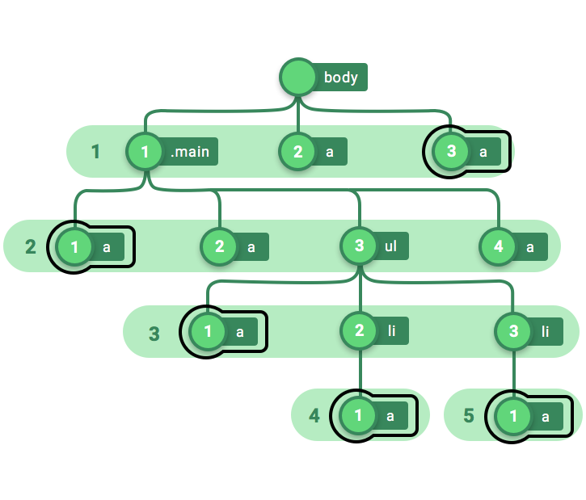

Folks at CSS Tricks have a very informative article called [Useful :nth-child Recipes](https://css-tricks.com/useful-nth-child-recipies/) you should check it out and put your knowledge of :`nth-child` to test*.* I challenge you m8.

With that we will move to the last selector of this article which punningly is `:nth-last-child` Holy shit! why is “punningly” a word even?

## Child pseudo-class #5 :nth-last-child
<br/>

This selector works exactly like `:nth-child` except that it starts selecting elements from the opposite direction just like that annoying high school teacher who would ask questions to the class starting from the peaceful folks seated at the last benches. God I hated him. If you look at the trees drawn so far, the children are numbered left to right in each section, but this selector bloke sees the tree like so

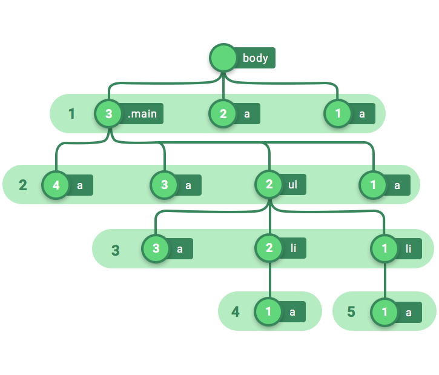

The children in each section are numbered right to left. So if we go ahead and apply the following style

```css
a:nth-last-child(1) { border: 2px solid black; }
```

the anchor elements will get selected as shown below.

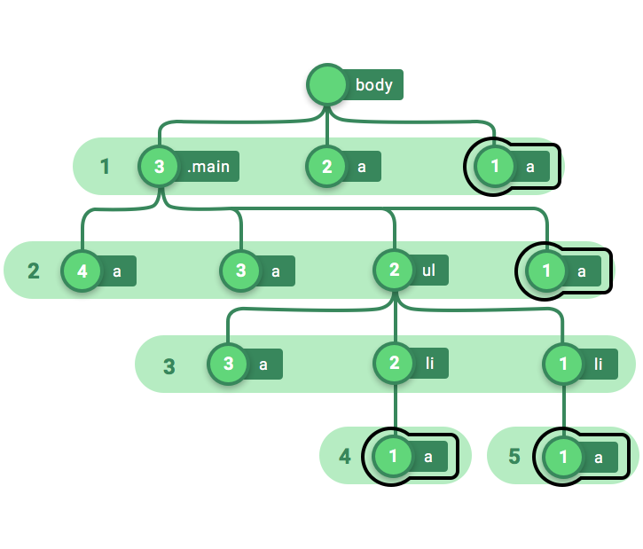

Quite straightforward isn’t it? This selector also very comfortably accepts formulas (of form `an + b`) and `even/odd` strings, the selections though, are made from the opposite end.

OK, this is where our journey together ends. You can pay for your ticket by tweeting this article to your developer buddies.

I hope you enjoyed reading this and learned something new, including some shiny new English words.

This is Nash signing off. I’ll see you in the next article. Follow me on [Twitter](http://twitter.com/NashVail) to keep in touch. I tweet about dev-related stuff. A lot.
