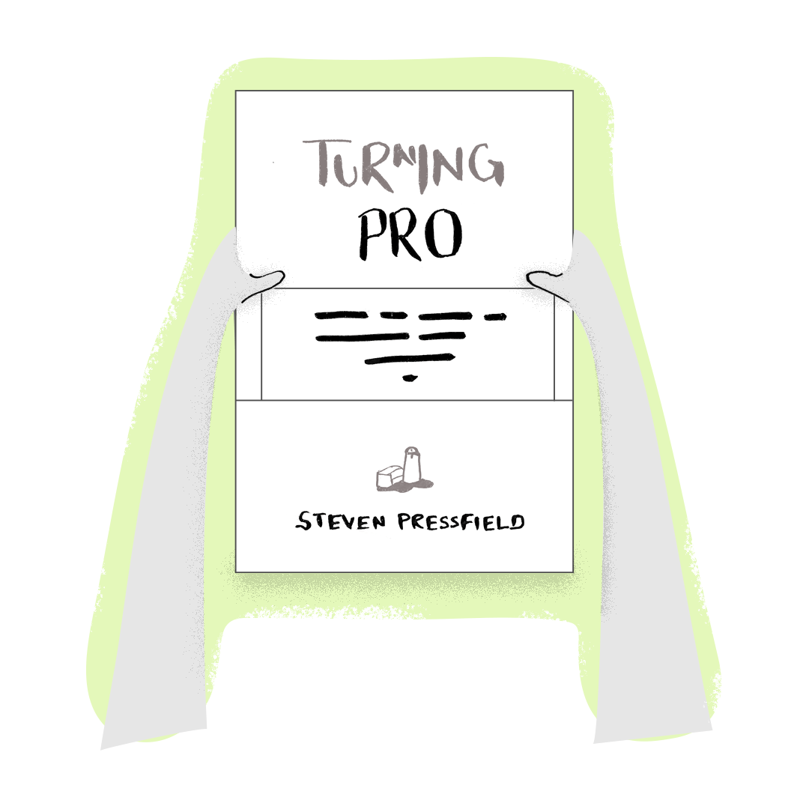
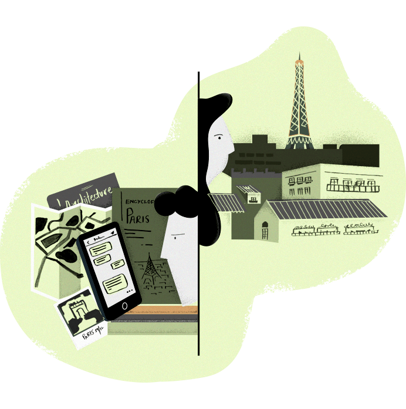

If I were to pick you and a friend of yours and to you give access to the city planners of Paris, the Instagram handles of its most famous architects-so you can DM them...and I'll make sure they respond. I give you the most detailed maps of the city, the exact opposite of what Apple Maps would give you. I bring for you every encyclopedia entry about Paris ever, every book and every tour guide ever written about Paris. And to your friend? I just drop her in Paris with a task to explore every nook and cranny of it.

After two months, which one of you will be a better Parisian? As in which one of you will know Paris better?

I recently finished reading [Turning Pro](https://amzn.to/2WAV2vh). There's this one idea in the book that had me pondering long after I had flipped the book close. I'd like to discuss that idea with you.

In Turning Pro, Steven Pressfield— the author— talks about something called **incapacity**. Incapacity starts with addiction. Addiction not *just* to substance, but to love, to distraction, to sex, to failure, money or trouble. To quote exact words from the [book](https://amzn.to/2WAV2vh):

All addictions share two primary qualities:

1. They embody repetition without progress.
2. They produce **incapacity** as a payoff.

Let's take trouble for example. The individual addicted to trouble will never get out of jail because he is safer behind the bars. When you're behind the bars you don't have to deal with the agonizing questions of existence, or embracing and materializing your dreams and visions. Being behind the bars produces for the prisoner **incapacity**.

Many people, some of whom I know personally, obsessively chase for love. They know in their soul that what they are actually after, is meaning. They choose to extract that meaning from love, hopping from one failed relationship to the next. Because when you’re busy finding that one love which will bring meaning to your existence you don’t have to worry about spending arduous hours honing your craft or bettering your career or finding meaning in something that only you are in control of. Such a behavior exudes an addiction to love, which is not to say that love is a bad thing, but its addiction definitely is. Such an addiction produces, **incapacity**. 

When you take this kind of addiction and put it in the context of the endless flow of knowledge on the internet, you will begin to see a similar pattern. On the internet, or because of it, people get addicted to learning, following one tutorial after another, taking one course after another, one article after another, one ["micro/centi/nano degree"](https://in.udacity.com/) after another that does nothing but produce incapacity and repetition without any real progress.

I remember having projects in hand, things to write, design and build. Instead of getting to work and finishing those, at several occasions I have chosen to take an online course or follow a tutorial or read through an article all of which were supposed to teach me how to build/design/write the said thing. 

So why is that bad? You see, it's not, it becomes bad when you continue learning even when you know enough. Even when you're capable of jumping right into the project and figure things along the way, you keep delaying it. Beginning something new is uncomfortable, therefore instead you choose to read an article or take a course just so you can tell yourself that you're working, but in reality, you're just looping, you're not making any progress on the project.

You can be in the back seat and travel to a place a hundred times. But until you take the driver's seat you'll never know the way. You’ve got to at one point stop taking directions and just go. Magic happens when you get your hands dirty.

Looking at this way, and I digress, you'll agree that by signing up for college you're essentially buying for yourself 4 years of incapacity. In college, you don't have to worry about forcing your way into your industry or making connections or finding a fulfilling job. You’re safe inside the campus because you’re working on a degree that will somehow magically give you the aforementioned things, which spoiler alert!.... 

It's a different thing when you don't know what you want to do with your life yet, in that case, college gives you enough breathing room to figure that out but if you do and you still choose to not skip college, you're just an incapacity hugging coward. Okay, that was a little too extreme, don't take my advice on college I am just salty because I couldn't complete mine. Now, getting back to the agenda.

What was your answer to the question I asked at the beginning? Who'll be a better Parisian? You reading books or your friend roaming around in Paris. It's common sense, to know Paris, you have to be in Paris, on the streets eating dust. Because if you don't, you will miss the synergy and the magic that happens when you’re in the arena. You have to get out there.

Often I have to interview people for engineering and design roles. More often than not all I find on their profiles are Udacity Nanodegrees, College degrees, Udemy course certificates and a myriad of other certifications with 0 real-world projects. That’s when I know that this person is soaked in incapacity to their bones. They won't take charge, they are not brave enough to face the discomfort of starting, creating something new and sending it out to the world. 

Are you addicted to learning? Ask yourself this. It's time to do magic, close the browser, leave the shore, jump off the cliff, cut the rope, pull the pin, pick up the pen, open your journal. Stop learning. Start doing. 