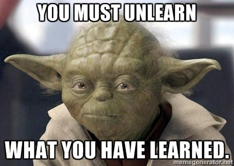
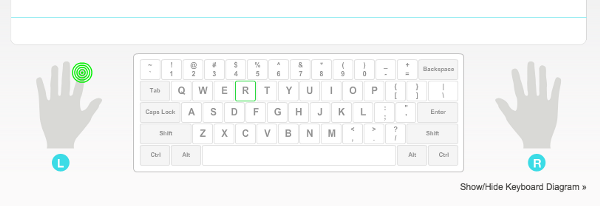
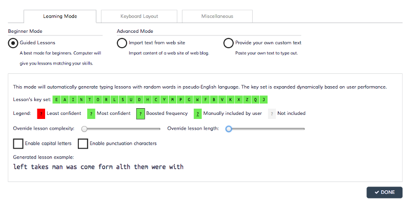
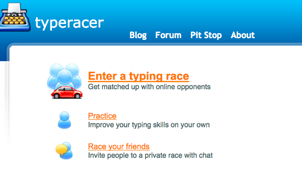
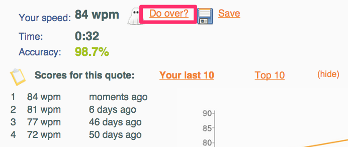

 

Back in February of this year, I was following an online Computer Science course, most of the time the camera would be pointed over to a white screen that displayed whatever was on the professor’s laptop, which mostly were presentation slides, but every once in a while the professor launched XCode to “code along”, and as she spoke the blank window would almost magically get filled by lines of code, as the camera panned over to the professor you can see her completely absorbed, staring at the display explaining every line of code while her fingers danced with utter brilliance over the keyboard making you believe as if they [knew their way around it](http://en.wikipedia.org/wiki/Muscle_memory). That was what got me fascinated and more than anything I wanted to touch type. As for everything else, I went online to find tons of articles explaining the [pros of touch typing](https://medium.com/message/the-joy-of-typing-fd8d091ab8ef) along with thousands of websites, apps, courses that promised to teach the skill. I will not say every one of them worked for me, what worked was a mix of the best of them along with some techniques of practicing that I developed over the months. So here they are, the first step

## Unlearn
 

Over the years I had gotten so used to [hunt and peck typing](http://en.wikipedia.org/wiki/Typing#Hunt_and_peck) that it grew really difficult to switch to a new technique, but as for any other skill, learning to touch type requires discipline and sacrifice, for the weeks until I was not able to type all the letters and some punctuation keys without looking at the keyboard, I used the index finger of my dominant hand for typing, no matter how slow, one of my hands always remained on my lap. This might seem like overkill to some people but no matter what try not to hunt and peck anymore.

## For starters, know the letters, period and comma
 

For now, stop caring about the numbers and symbols, you can glance at the keyboard for them, letters and the two punctuation keys are most hit keys on the keyboard, the sooner you learn them the better. Out of dozens of websites that give step by step practice going through each row of keys I found [TypeFu](https://chrome.google.com/webstore/detail/type-fu/pofoighmmpljaikjiidkkfhldjndfdbk?hl=en) and [typing.com](http://www.typingweb.com/) (previously typingweb.com) the best, personally I used TypeFu to get started but since it isn’t free anymore let’s stick with typing.com, you can choose either as both of them provide very similarly structured lessons. Completing just the “Beginner’s course” from typing.com will prove sufficient for our current objective.

Food for thought:

Never skip the tip they show before the beginning of every lesson. Also be sure to make full use of the visible keyboard and finger indicator, these prove to be of great use when you just can’t figure out the correct finger. Do not rush, the faster you go the slower you’ll get. Tame accuracy, speed will follow.

> Tame accuracy, speed will follow.

By the end of the Beginner’s course you should be able to type complete words and sentences all in lower case without looking at the keyboard. Once that is done it’s time to venture out.

## Venturing out
 

### Keybr.com
 

Next, it’s time build up on your newly learnt skill, leaving typing.com behind let me introduce you to [Keybr](http://www.keybr.com/). Keybr is an excellent web app that grows more complex as you begin mastering the skill. They also have an algorithm backing their app that generates lessons based on your previous performances. Once you've registered on Keybr, your initial settings should be as shown below.

Keybr provides lessons in short bursts. Everyday, try to complete at least three _consecutive_ lessons with no errors at all.

> Everyday, try to complete at least three consecutive lessons with no errors at all

Once this starts feeling relatively easy, increase lesson complexity and length, enable Capital Letters and eventually the Punctuation Characters. Still following the same daily routine.

Sadly Keybr doesn’t provide lessons in the number row keys. For that, since you’ve made this far, typing.com’s Intermediate Course > Number Letters Numbers, lesson will be easy to grasp.

### Typeracer.com
 

Typeracer has a special place in the hearts of budding and even master typists, as the name clearly suggests typeracer is a simple yet effective online game in which you race against contestants of same skill level as yours by typing in paragraphs and quotes as fast as possible. What I found more effective was not the race but the practice section. The trick here is to master the most used words in English by typing them over and over. Try to complete at least one practice session daily with an accuracy of at least 97%. Didn’t get it right in the first shot? _Do Over the_ same lesson.

## Pro Tips
 

1.  Keep your fingernails short.
2.  For typing capital letters, hold the shift button far away from the letter you're trying to type and with the opposite hand.

3\. For that one or few keys that you always keep missing, consider adding bumps to those keys, like sticking a small square piece of sellotape/Scotch tape on top of the key. So your brain knows it is reaching out for the right key.

4\. Be patient.

Touch typing isn't about typing fast, it’s about translating your thoughts faster, because, “If you can't move quickly enough, your idea can slip away and never come back” .