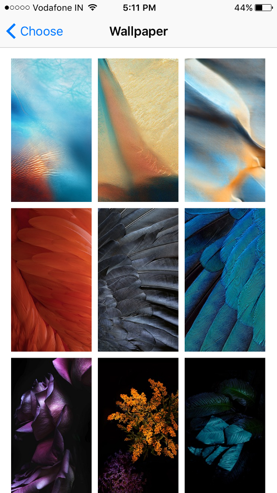
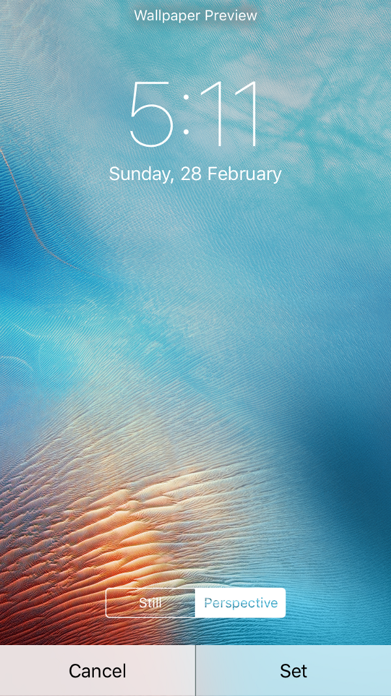
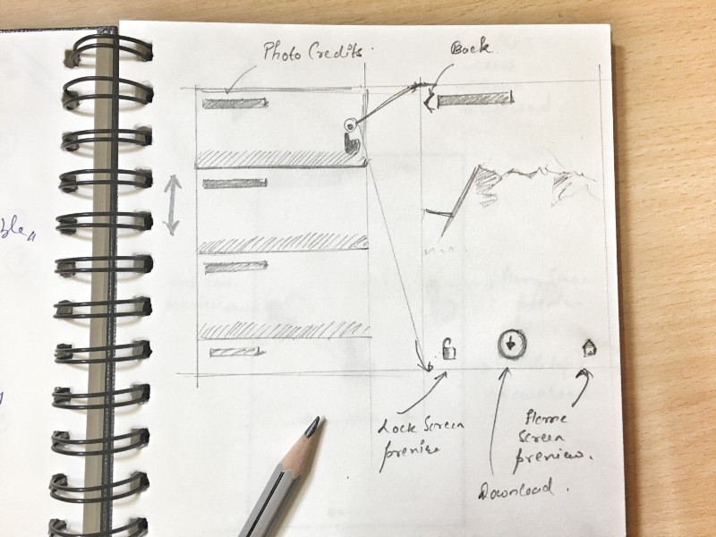
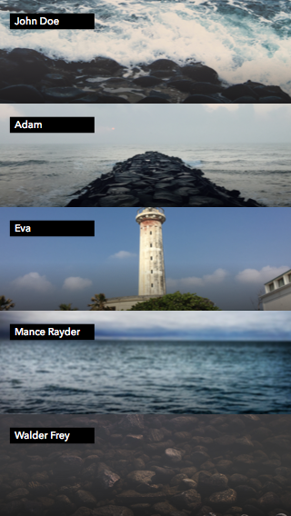
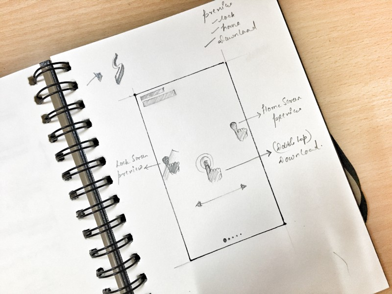

Wallpaper apps don’t get a whole lot of love, do they? Then one day [WLPPR](http://wlppr.co/) came along. It’s a beautifully designed app with a ton of beautiful wallpapers. All of the wallpapers, though definitely breathtaking are some kind of satellite image of our Solar System. I just wanted more variety of wallpapers wrapped in a beautifully built app. I couldn’t find one so I decided to build one myself. This article goes through the process of designing that app.

## Goal

It’s always a good idea to define what your app will do before you design how the app will do it. Here, the goal was simple. To design an app that a user can launch, quickly view and download a wallpaper of his/her liking. The app is not supposed to occupy you for a long period of time. All of this coupled with an elegant and smart UI and we have the app.

Before diving in, the first question that came up was, where to get the wallpapers from? The answer — [Unsplash](http://unsplash.com). In case you’re not aware (really?) Unsplash hosts these beautiful high quality images that are free and you can do whatever you want with them. Each single photo on Unsplash is not only worthy of being used as a wallpaper but also beautiful enough to be framed and hung in your living room. ([Check out my Unsplash profile](https://unsplash.com/nashvail)).

## Explorations

The very obvious place to look for initially is how iOS handles selection of wallpaper.

A grid of images is shown. You tap on one of your choice, lockscreen preview comes up with an option to set the wallpaper. If you’re happy with what you see, you set the wallpaper.

Hmmm… very straightforward, but we can do better. Moreover there is something Apple missed in the whole process of setting the wallpaper, I don’t know if intentionally. I talk about this later in the article.

One of the iterations that I considered going forward with had the images visible in a List View. Each row showed a part of image along with the credits (name of the person who presumably captured and uploaded the photo to Unsplash).

Showing fetched images as a list

Tapping on a row brings up a full screen preview of the image. From there you have three options — 1) To download the image 2) To preview how the image looks on the lock screen and 3) To preview how the image looks on the home screen.

Earlier when I was talking about Apple missing a step, I meant the third option mentioned above. I don’t understand why iOS doesn’t give you an option to preview the wallpaper on the home screen. [Let me know](http://twitter.com/NashVail) if you have any rationale about this decision.

I could’ve went forward with this, but I came up with something that I think is a little better than this solution and simpler too. Simple is good.

According to me, viewing an image in the list, then tapping to get a full size view is just an extra step. It can be gotten rid of. So, instead of showing a list I decided to directly show full screen previews of the images.

Before we start exploring more of this design, allow me to talk about a decision I made regarding the number of wallpapers that are shown at once to the user. Design is just a set of decisions and decisions are subjective. If at any point you don’t agree with something, [hit me up](http://twitter.com/NashVail), I’d love to have a discussion.

So, as mentioned in the goal, I didn’t want the app to occupy me, make me spend longer than needed time to just select a wallpaper for my phone. [I have better things to do](https://www.youtube.com/watch?v=04cF1m6Jxu8). To fulfill this need I made a decision of showing just 5 wallpapers on launch to the user. Think about it, if you ran an experiment to compare average time user spends on selecting a wallpaper on a app that shows just 5 wallpapers on launch and another app that shows unlimited or a large number of them, the one with 5 wallpapers will end up with a lesser average time.

To continue from where we left off, instead of showing wallpapers in a list to show them directly as full screen previews in a slider.

But where did the buttons go yo? I decided to replace them with gestures —

1. To show home screen preview tap and hold on the right part of the display.
2. To show lock screen preview tap and hold on the left part.
3. To download, double tap anywhere on the image.

Here’s a fancy video I cobbled up showing how the gestures work.

`video: https://www.youtube.com/embed/6921TjFGg_k`

At the time of recording the demo the slider dots were not implemented so ignore that part.

After using the app for a while I realised something. Often times the 5 wallpapers that are initially shown didn’t please me, I had to kill the app and relaunch it just to get 5 new wallpapers and I found myself doing this a lot. To solve this issue I thought of increasing the number of wallpapers that are initially shown from 5 to 10. Could’ve worked but I decided to side with a better solution.

I added a shake gesture, now, anytime while within the app you can shake your iPhone to fetch 5 new wallpapers.

Here’s how the app looks and works like.

`video: https://www.youtube.com/embed/MT2o7WHpHD4`

So what do you think? Looks good? What would be your take at designing a wallpaper app?

## Where can I get the app?

[Here it is on GitHub](https://github.com/nashvail/SplashWalls). 

This app was built in [React Native](https://facebook.github.io/react-native/). It was an amazing experience, building a complete app in JavaScript. I worked with Smashing Magazine on a 2 part tutorial series that describes building the app from ground up. Interested? Follow along.

*   [The Beauty Of React Native: Building Your First iOS App With JavaScript (Part 1)](https://www.smashingmagazine.com/2016/04/the-beauty-of-react-native-building-your-first-ios-app-with-javascript-part-1/ "Read 'The Beauty Of React Native: Building Your First iOS App With JavaScript (Part 1)'")
*   [The Beauty Of React Native: Building Your First iOS App With JavaScript (Part 2)](https://www.smashingmagazine.com/2016/04/how-to-build-your-first-ios-app-with-javascript/ "Read 'The Beauty Of React Native: Building Your First iOS App With JavaScript (Part 2)'")